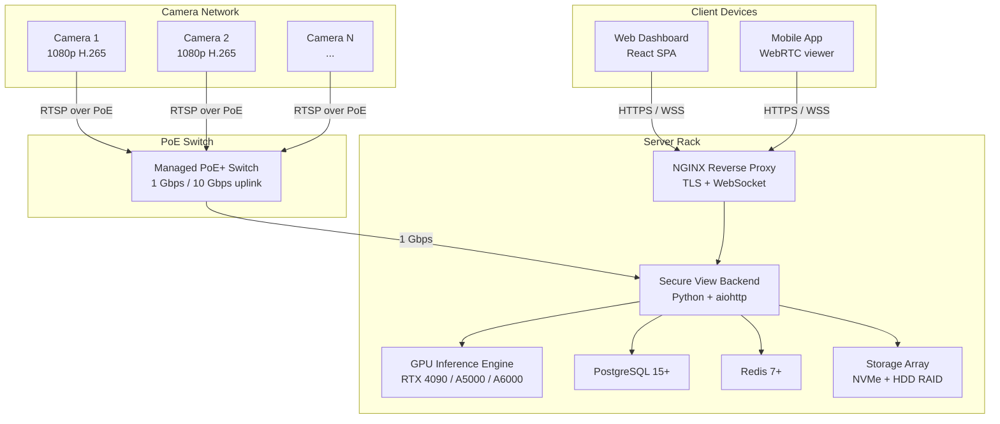
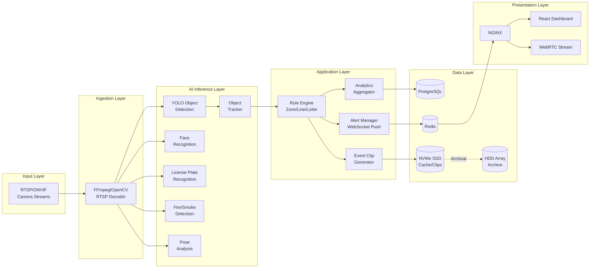
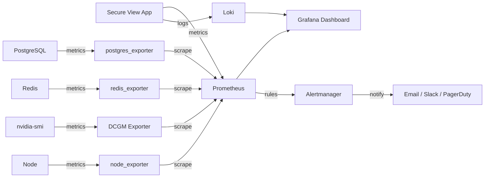
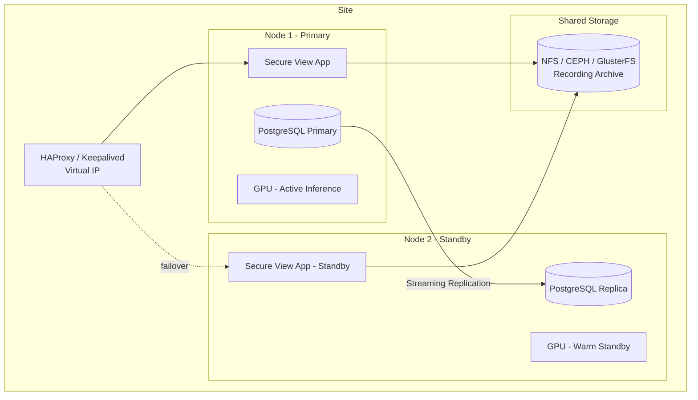
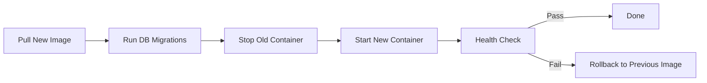

# Secure View — Enterprise Deployment & Infrastructure Sizing Guide

**Document Classification**: Pre-Sales Technical Architecture & Procurement Guide
**Version**: 2.0.0 | **Date**: May 2026
**Prepared By**: Solutions Architecture Team
**Audience**: Enterprise Clients, Infrastructure Teams, Procurement, Management

---

> [!IMPORTANT]
> This document is intended for enterprise clients deploying Secure View on **self-hosted on-premise or private cloud infrastructure**. Secure View does NOT require or use any vendor-hosted cloud services. All data, AI inference, and storage remain entirely within the client's own network perimeter.

---

## Table of Contents

1. [Executive Summary](#1-executive-summary)
2. [Product Overview](#2-product-overview)
3. [Deployment Models](#3-deployment-models)
4. [System Architecture](#4-system-architecture)
5. [End-to-End Data Flow](#5-end-to-end-data-flow)
6. [Camera Compatibility](#6-camera-compatibility)
7. [Network Requirements](#7-network-requirements)
8. [Internet Requirements](#8-internet-requirements)
9. [Hardware Sizing Methodology](#9-hardware-sizing-methodology)
10. [AI Inference Assumptions](#10-ai-inference-assumptions)
11. [Deployment Tiers & Hardware Sizing](#11-deployment-tiers--hardware-sizing)
12. [GPU Recommendations](#12-gpu-recommendations)
13. [CPU Recommendations](#13-cpu-recommendations)
14. [Storage Architecture](#14-storage-architecture)
15. [Recording Retention Calculations](#15-recording-retention-calculations)
16. [Deployment Examples](#16-deployment-examples)
18. [Scaling Bottlenecks](#18-scaling-bottlenecks)
19. [Observability Stack](#19-observability-stack)
20. [Security Considerations](#20-security-considerations)
21. [Backup & Disaster Recovery](#21-backup--disaster-recovery)
22. [High Availability Architecture](#22-high-availability-architecture)
23. [Kubernetes Deployment](#23-kubernetes-deployment)
24. [Docker Compose Deployment](#24-docker-compose-deployment)
25. [Upgrade Strategy](#25-upgrade-strategy)
26. [Future Scalability Roadmap](#26-future-scalability-roadmap)
27. [Assumptions & Limitations](#27-assumptions--limitations)
28. [Final Deployment Recommendations](#28-final-deployment-recommendations)

---

## 1. Executive Summary

Secure View is an enterprise-grade, AI-powered CCTV analytics platform designed for **self-hosted deployment** on customer-owned infrastructure. It transforms standard IP camera feeds into actionable intelligence through real-time object detection, face recognition, intrusion detection, behavioral analytics, license plate recognition, and anomaly detection — all processed locally with zero data egress to external cloud services.

### Why Self-Hosted?

| Concern | Secure View Approach |
|---|---|
| **Data Sovereignty** | All video, metadata, and AI inference stay within the client's physical or logical network boundary. No frames leave the premises. |
| **Latency** | Sub-100ms alert latency achievable on local GPU hardware; cloud round-trips eliminated. |
| **Compliance** | Meets GDPR, HIPAA, PCI-DSS, and government security mandates for on-premise video surveillance data. |
| **Offline Operation** | System operates fully offline. Internet is optional (for remote access, updates). |

### Key Metrics at a Glance

| Metric | Value |
|---|---|
| Supported Camera Count (single server) | 1–50+ cameras (GPU-dependent) |
| AI Inference Latency (per frame) | 5–25 ms (model-dependent) |
| Real-Time Processing FPS | 5–30 FPS per stream (tier-dependent) |
| VRAM per Camera (Basic) | ~200–400 MB |
| VRAM per Camera (Full Pipeline) | ~400–800 MB |
| Storage per Camera per Day (1080p, 15 FPS) | ~45–90 GB (codec-dependent) |
| Supported Deployment | Docker Compose / Kubernetes / Bare Metal |
| Frontend | React SPA (Vite + TailwindCSS) |
| Backend | Python (aiohttp/asyncpg), GPU-accelerated inference |
| Database | PostgreSQL 15+ |

---

## 2. Product Overview

### 2.1 Core Capabilities

| Capability | Description | Module |
|---|---|---|
| **RTSP Camera Ingestion** | Connects to any ONVIF/RTSP-compatible IP camera. Supports H.264/H.265, configurable FPS and resolution. | Core |
| **AI Object Detection** | GPU-accelerated person/object detection with custom-trained deep learning models. Configurable model tiers for accuracy vs. speed tradeoff. | Core |
| **Persistent Object Tracking** | ByteTrack + EMA smoothing for stable, flicker-free bounding boxes across frames. | Core |
| **Real-Time Analytics** | Per-camera analytics: person count, dwell time, zone occupancy, directional flow. | Core |
| **Event Alerts** | Rule-based alerting: zone intrusion, virtual line crossing, loitering, parking violations. | Core |
| **Recording & Clip Capture** | Continuous recording + event-triggered MP4 clip generation with metadata overlay. | Core |
| **Dashboard Monitoring** | React-based SPA with multi-camera grid view, focus view, WebRTC ultra-low-latency streaming. | Core |
| **Multi-Tenant RBAC** | Super Admin → Admin → Member role hierarchy with JWT-based authentication. | Core |
| **Remote Viewing** | WebRTC streaming at 1280×720 @ 30 FPS with 6 Mbps bitrate. | Core |

### 2.2 Optional AI Modules

| Module | Description | Additional VRAM (est.) | Additional Latency (est.) |
|---|---|---|---|
| **Face Recognition** | Deep learning face detection + embedding-based recognition (ArcFace-class models) | 500–1,500 MB | 2–8 ms/batch (amortized: 0.3–1.0 ms/frame) |
| **License Plate Recognition (LPR)** | Detection model + OCR pipeline for vehicle plates | 300–800 MB | 5–15 ms/frame |
| **Fire & Smoke Detection** | Custom-trained fire/smoke classification model | 200–600 MB | 3–10 ms/frame |
| **Posture / Behavior Analytics** | Pose landmark estimation per detected person | 50–300 MB | 2–8 ms/person/frame |
| **Anomaly Detection** | Statistical + ML-based anomaly scoring on event streams | 50–200 MB | 1–3 ms |

> [!NOTE]
> **VRAM estimates are baseline minimums.** Actual VRAM consumption depends on the specific model architecture, precision (FP32/FP16/INT8), batch size, and input resolution chosen at deployment time. The values above represent typical ranges for production-grade models in each category. Larger or more accurate model variants will consume more VRAM — use the sizing formulas in Section 9 to calculate exact requirements for your chosen model stack.

### 2.3 Technology Stack

| Layer | Technology | Purpose |
|---|---|---|
| **Inference Engine** | PyTorch 2.5+ (CUDA 12.x), ONNX Runtime GPU, TensorRT (optional) | GPU-accelerated AI model execution |
| **Video Processing** | OpenCV 4.12+, FFmpeg, PyAV | RTSP decode, frame manipulation, transcoding |
| **Backend** | Python 3.10, aiohttp, asyncpg | Async HTTP/WS server, database access |
| **Database** | PostgreSQL 15+ | Persistent storage for users, cameras, events, analytics |
| **Cache / Pub-Sub** | Redis 7+ | Session cache, real-time event pub/sub, rate limiting |
| **Reverse Proxy** | NGINX | TLS termination, static asset serving, WebSocket proxy |
| **Streaming** | WebRTC (aiortc) | Ultra-low-latency browser video delivery |
| **Frontend** | React 18+ (Vite, TailwindCSS) | Admin dashboard, camera management, analytics UI |
| **Containerization** | Docker, Docker Compose, Kubernetes | Deployment orchestration |
| **Monitoring** | Prometheus + Grafana + Loki | System and application observability |

---

## 3. Deployment Models

Secure View supports four deployment architectures. The choice depends on site topology, camera count, latency requirements, and IT infrastructure maturity.

### 3.1 Deployment Model Comparison

| Factor | Edge | On-Prem Server | Hybrid | Private Cloud |
|---|---|---|---|---|
| **Camera Count** | 1–8 | 1–100+ | 1–500+ | 1–1000+ |
| **GPU** | Jetson Orin / RTX 4060 | RTX 4090 / A5000 / A6000 | Mixed | Cloud GPU (A10G, L4, A100) |
| **Latency** | <50 ms | <100 ms | 50–200 ms | 100–500 ms |
| **Internet Required** | No | No | WAN between sites | Yes (private cloud) |
| **Best For** | Retail, ATMs, gates | Warehouses, campuses | Multi-site enterprise | IT-mature orgs with private DC |

### 3.2 Edge Deployment

**Use Case**: Small retail stores, ATM kiosks, gate/entrance monitoring (1–8 cameras).

**Architecture**: A compact GPU-equipped appliance deployed at the physical camera location. Runs all Secure View services in a single Docker Compose stack.

```
┌──────────────────────────────────────────┐
│            Edge Appliance                │
│  ┌──────┐  ┌────────┐  ┌──────────────┐ │
│  │ NGINX│→ │ SecureVu│→ │ PostgreSQL   │ │
│  │ (TLS)│  │ Backend │  │ (embedded)   │ │
│  └──────┘  └────┬───┘  └──────────────┘ │
│                 │                        │
│           ┌─────▼─────┐                  │
│           │  GPU (YOLO │                  │
│           │  + FaceID) │                  │
│           └───────────┘                  │
│                                          │
│  ← RTSP ← IP Cameras (PoE switch)       │
└──────────────────────────────────────────┘
```

**Hardware**: NVIDIA Jetson Orin NX (16 GB), Jetson AGX Orin (64 GB), or compact workstation with RTX 4060/4070.

**Tradeoffs**:
- ✅ Lowest latency (camera → GPU on same LAN segment)
- ✅ Fully air-gapped; no internet dependency
- ✅ Simple deployment (single Docker Compose)
- ❌ Limited scalability (GPU-bound)
- ❌ No built-in redundancy
- ❌ Physical security risk (device at edge location)

### 3.3 On-Premise Server Deployment

**Use Case**: Warehouses, manufacturing plants, corporate campuses, apartment complexes (10–100 cameras).

**Architecture**: Rack-mounted server(s) in a server room or data closet. Enterprise GPU(s), redundant storage, UPS-backed power.



**Tradeoffs**:
- ✅ High camera density per server
- ✅ Centralized management and monitoring
- ✅ Redundant storage (RAID-6/ZFS)
- ✅ UPS protection
- ❌ Requires server room, cooling, and rack space
- ❌ Single point of failure without HA setup
- ❌ Higher upfront cost

### 3.4 Hybrid Deployment

**Use Case**: Multi-site enterprise (retail chain, logistics network, smart campus) with 50–500+ cameras across locations.

**Architecture**: Edge appliances at each site for real-time inference; centralized on-prem or private cloud server for aggregation, analytics dashboard, and long-term storage.

**Tradeoffs**:
- ✅ Best of both: local inference + centralized management
- ✅ Survives WAN outages (edge runs independently)
- ✅ Scales horizontally by adding edge nodes
- ❌ Requires WAN/VPN infrastructure
- ❌ Complex deployment and orchestration (Kubernetes recommended)
- ❌ Data synchronization challenges

### 3.5 Private Cloud Deployment

**Use Case**: Organizations with existing private cloud infrastructure (VMware vSphere, OpenStack, Proxmox) or managed GPU cloud (AWS Outposts, Azure Stack).

**Architecture**: Virtual machines or Kubernetes pods with GPU passthrough. Leverages existing cloud-native tooling for scaling, monitoring, and DR.

**Tradeoffs**:
- ✅ Leverages existing infrastructure investment
- ✅ Dynamic scaling (GPU autoscaling)
- ✅ Built-in DR and HA if cloud provides it
- ❌ GPU passthrough complexity (SR-IOV, vGPU licensing)
- ❌ Higher latency than direct edge deployment
- ❌ Requires GPU-capable hypervisor/cloud

---

## 4. System Architecture

### 4.1 Logical Architecture



### 4.2 Container Architecture (Docker)

| Container | Image Base | GPU Access | Ports | Persistent Volumes |
|---|---|---|---|---|
| `secureview-app` | `nvidia/cuda:12.4-runtime-ubuntu22.04` | ✅ Required | 8000 (internal) | `/app/models`, `/app/event_clips`, `/app/tracking` |
| `secureview-nginx` | `nginx:1.27-alpine` | ❌ | 443, 80 | `/etc/nginx/conf.d`, `/certs` |
| `secureview-db` | `postgres:16-alpine` | ❌ | 5432 (internal) | `/var/lib/postgresql/data` |
| `secureview-redis` | `redis:7-alpine` | ❌ | 6379 (internal) | `/data` |
| `secureview-prometheus` | `prom/prometheus:latest` | ❌ | 9090 (internal) | `/prometheus` |
| `secureview-grafana` | `grafana/grafana:latest` | ❌ | 3000 (internal) | `/var/lib/grafana` |

### 4.3 Process Architecture (Single Server)

| Process | CPU Threads | GPU Utilization | RAM | Function |
|---|---|---|---|---|
| Main Event Loop (aiohttp) | 1 | 0% | ~200 MB | HTTP/WS routing, session management |
| RTSP Decoder (per camera) | 1–2 | 0–5% (NVDEC) | ~100 MB/stream | Frame decode from RTSP |
| Object Detection Inference | 1 | 30–90% | 400–1,200 MB VRAM | Primary detection model (varies by architecture and precision) |
| Face Recognition Inference | 1 | 2–5% | 500–1,500 MB VRAM | Face embedding + matching (varies by model tier) |
| ByteTrack | 1 | 0% | ~10 MB | Tracking state machine |
| Rule Engine | 1 | 0% | ~50 MB | Zone/line/loiter evaluation |
| Event Clip Writer | 1–2 | 0% | ~100 MB | MP4 muxing to disk |
| WebRTC Encoder | 1–2 | 0–10% (NVENC) | ~200 MB/stream | H.264 encode for browser |
| PostgreSQL | 2–4 | 0% | ~500 MB | Query processing |
| Redis | 1 | 0% | ~100 MB | Pub/sub, cache |

---

## 5. End-to-End Data Flow

### 5.1 Frame Processing Pipeline

```
Camera (H.265 RTSP) 
  → [Network: 2-8 Mbps per stream]
  → FFmpeg/OpenCV RTSP Decoder (CPU/NVDEC)
  → Raw Frame (BGR, 1920×1080) 
  → [Resize to inference resolution: 640×640 or 1280×1280]
  → Object Detection Model (GPU, 2-25 ms depending on model tier)
  → Object Tracker Association (CPU, 0.3-0.5 ms)
  → [Optional] Face Crop → Face Recognition Model (GPU, 2-8 ms, configurable frequency)
  → [Optional] Pose Estimation → Pose Model (CPU/GPU, 2-8 ms)
  → Rule Evaluation (CPU, <1 ms)
  → Alert Dispatch (Redis pub/sub → WebSocket)
  → Event Clip Capture (NVMe write, async)
  → Analytics Aggregation (PostgreSQL write, batched)
  → Annotated Frame → WebRTC Encode (NVENC, 2-5 ms)
  → Browser (WebRTC, <100 ms glass-to-glass)
```

### 5.2 Latency Budget (Single Frame, Full Pipeline)

| Stage | Latency | Hardware |
|---|---|---|
| RTSP Network Transit | 5–50 ms | Network (depends on camera/switch) |
| RTSP Decode (H.265) | 2–5 ms | CPU (or 0.5 ms with NVDEC) |
| Frame Resize | <0.1 ms | GPU |
| Object Detection | 2–25 ms | GPU (model tier and resolution dependent) |
| Object Tracking | 0.3–0.5 ms | CPU |
| Face Recognition (amortized) | 0.3–1.0 ms | GPU |
| Rule Evaluation | <0.5 ms | CPU |
| WebRTC Encode | 2–5 ms | GPU (NVENC) |
| WebRTC Network Transit | 1–20 ms | LAN |
| **Total Glass-to-Glass** | **16–102 ms** | — |

> [!NOTE]
> "Glass-to-glass" measures the time from a photon hitting the camera sensor to a pixel updating on the operator's monitor. The dominant variable is YOLO inference time, which is directly controlled by model selection and inference resolution.

---

## 6. Camera Compatibility

### 6.1 Protocol Support

| Protocol | Support Level | Notes |
|---|---|---|
| **RTSP** | ✅ Full | Primary ingestion protocol. TCP and UDP transport supported. |
| **ONVIF** | ✅ Full | Device discovery, PTZ control, event subscription via `onvif_zeep`. |
| **RTMP** | ⚠️ Partial | Supported via FFmpeg relay; not recommended for primary ingestion. |
| **HTTP MJPEG** | ⚠️ Legacy | Supported but high bandwidth; avoid for new deployments. |
| **USB/V4L2** | ✅ Dev Only | For local webcam testing; not for production. |

### 6.2 Codec & Stream Recommendations

| Parameter | Minimum | Recommended | Why |
|---|---|---|---|
| **Video Codec** | H.264 (AVC) | H.265 (HEVC) | H.265 reduces bandwidth by 40–50% vs H.264 at equivalent quality. Directly impacts storage costs and network load. |
| **Resolution** | 720p (1280×720) | 1080p (1920×1080) | 1080p provides sufficient detail for face recognition at 10–15m range. 4K is overkill for most AI detection and doubles GPU decode workload. |
| **Frame Rate** | 10 FPS | 15 FPS | 15 FPS is optimal for detection accuracy vs. bandwidth. Higher FPS adds negligible detection value but increases decode/bandwidth cost. |
| **Bitrate (H.265)** | 1 Mbps | 2–4 Mbps | Variable bitrate (VBR) recommended. CBR at 4 Mbps is the upper bound for 1080p H.265. |
| **Bitrate (H.264)** | 2 Mbps | 4–6 Mbps | H.264 requires ~2× bitrate of H.265 for equivalent quality. |
| **I-Frame Interval** | 1s (GOP=15) | 2s (GOP=30) | Shorter GOP improves seek accuracy in recordings but increases bitrate by 10–15%. |
| **Sub-Stream** | Required | Required | Use sub-stream (D1/CIF, 640×480 @ 10 FPS) for grid view / AI inference on high-density setups. Main stream for recording. |

### 6.3 Bitrate vs. Storage Reference

| Resolution | Codec | FPS | Bitrate | Per Camera Per Hour | Per Camera Per Day |
|---|---|---|---|---|---|
| 1080p | H.264 | 15 | 4 Mbps | 1.8 GB | **43.2 GB** |
| 1080p | H.265 | 15 | 2 Mbps | 0.9 GB | **21.6 GB** |
| 1080p | H.265 | 25 | 3 Mbps | 1.35 GB | **32.4 GB** |
| 4K | H.265 | 15 | 8 Mbps | 3.6 GB | **86.4 GB** |
| 720p | H.265 | 10 | 1 Mbps | 0.45 GB | **10.8 GB** |

**Formula**: `Storage (GB/day) = Bitrate (Mbps) × 3600 × 24 / 8 / 1000`

### 6.4 PoE Considerations

| Factor | Recommendation |
|---|---|
| **PoE Standard** | IEEE 802.3af (PoE, 15.4W) for fixed cameras; IEEE 802.3at (PoE+, 30W) for PTZ |
| **Switch Budget** | Calculate total camera wattage + 20% headroom. Example: 16 cameras × 12W = 192W → 250W PoE budget switch minimum |
| **Cable Length** | Cat6 UTP, maximum 100m per run. Use PoE extenders for longer runs. |
| **Cable Quality** | Cat6 minimum for 1 Gbps. Cat6A for 10 Gbps uplinks. Pure copper, not CCA (Copper Clad Aluminum). |

### 6.5 Recommended Camera Brands (Tested Compatible)

| Brand | Model Range | Protocol | Resolution | Notes |
|---|---|---|---|---|
| **Hikvision** | DS-2CD series | RTSP + ONVIF | 2MP–8MP | Most widely deployed. RTSP URL: `rtsp://<user>:<pass>@<ip>:554/Streaming/Channels/101` |
| **Dahua** | IPC-HDW series | RTSP + ONVIF | 2MP–8MP | RTSP URL: `rtsp://<user>:<pass>@<ip>:554/cam/realmonitor?channel=1&subtype=0` |
| **Axis** | M-series, P-series | RTSP + ONVIF | 2MP–4K | Enterprise-grade. Higher cost but excellent ONVIF compliance. |
| **Reolink** | RLC series | RTSP | 2MP–4K | Cost-effective. Limited ONVIF support on older models. |
| **Uniview** | IPC-B series | RTSP + ONVIF | 2MP–4K | Budget enterprise option. |
| **CP Plus** | CP-UNC series | RTSP + ONVIF | 2MP–4MP | Widely available in India. Budget-friendly. |

> [!WARNING]
> **Avoid cameras that only support proprietary protocols** (e.g., some Wyze, Ring, Arlo consumer models). Secure View requires standard RTSP access. Always verify RTSP URL format and credentials before bulk procurement.

---

## 7. Network Requirements

### 7.1 Bandwidth Calculations

**Formula**: `Total LAN Bandwidth = N_cameras × Bitrate_per_camera`

| Camera Count | Bitrate/Camera (H.265) | Total LAN Bandwidth | Recommended Switch |
|---|---|---|---|
| 1–8 | 2 Mbps | 2–16 Mbps | Unmanaged Gigabit (sufficient) |
| 10–16 | 2 Mbps | 20–32 Mbps | Managed Gigabit with PoE |
| 25 | 2 Mbps | 50 Mbps | Managed Gigabit, VLAN segmentation |
| 50 | 2 Mbps | 100 Mbps | Managed Gigabit, 10G uplink |
| 100 | 2 Mbps | 200 Mbps | 10G spine-leaf, VLAN per zone |

> [!IMPORTANT]
> These are **steady-state** bandwidth figures. During I-frame bursts, instantaneous bandwidth can spike to 3–5× the average. Over-provision by at least 50% to accommodate bursts and prevent frame drops.

### 7.2 Network Architecture Recommendations

| Camera Count | Architecture | Switch Tier | Uplink |
|---|---|---|---|
| 1–8 | Flat network | Unmanaged PoE | 1 Gbps |
| 10–25 | VLAN segregation (camera + management) | L2 Managed PoE | 1 Gbps |
| 25–50 | VLAN + QoS + STP | L3 Managed PoE | 2× 1 Gbps LAG or 10 Gbps |
| 50–100 | Spine-leaf, dedicated camera VLAN | Enterprise L3 PoE | 10 Gbps |
| 100+ | Spine-leaf, distributed edge switches | Enterprise L3, stacking | 2× 10 Gbps LAG |

### 7.3 VLAN Recommendations

| VLAN | Purpose | Traffic Type | Security |
|---|---|---|---|
| VLAN 10 | Camera Network | RTSP unicast | Isolated; no internet; ACL: only server IPs allowed |
| VLAN 20 | Server/Management | Backend, DB, Redis | Restricted; admin access only |
| VLAN 30 | Client Access | Dashboard, WebRTC | Authenticated; TLS required |
| VLAN 40 | Monitoring | Prometheus, Grafana, SNMP | Internal only |

### 7.4 Firewall Requirements

| Direction | Source | Destination | Port | Protocol | Purpose |
|---|---|---|---|---|---|
| Inbound | Cameras (VLAN 10) | Server (VLAN 20) | 554 | TCP/UDP | RTSP streams |
| Inbound | Clients (VLAN 30) | NGINX (VLAN 20) | 443 | TCP | HTTPS dashboard |
| Inbound | Clients (VLAN 30) | NGINX (VLAN 20) | 443 | UDP | WebRTC media (STUN/TURN) |
| Internal | Server | PostgreSQL | 5432 | TCP | Database |
| Internal | Server | Redis | 6379 | TCP | Cache/pub-sub |
| Outbound | Server | NTP server | 123 | UDP | Time synchronization (critical for event timestamps) |
| Outbound (optional) | Server | Update server | 443 | TCP | Software updates |

### 7.5 VPN Recommendations

| Scenario | VPN Technology | Setup |
|---|---|---|
| Remote admin access | WireGuard (preferred) or OpenVPN | Site-to-admin tunnel; split-tunnel to avoid routing all traffic |
| Multi-site hybrid | WireGuard mesh or IPSec site-to-site | Dedicated tunnel per site; BGP/OSPF for dynamic routing |
| Remote viewing (mobile) | WireGuard client app | User-level VPN to access dashboard over public internet |

### 7.6 Latency Tolerances

| Path | Maximum Acceptable Latency | Impact of Excessive Latency |
|---|---|---|
| Camera → Server (RTSP) | 50 ms | Frame drops, decode errors, stale detections |
| Server → Browser (WebRTC) | 150 ms | Visible lag in live view |
| Server → Database | 5 ms | Slow event logging, dashboard lag |
| Server → Redis | 2 ms | Alert delivery delay |
| Cross-site (hybrid WAN) | 200 ms | Acceptable for dashboard; not for real-time alerting |

---

## 8. Internet Requirements

### 8.1 When Internet is Required

| Function | Internet Required? | Notes |
|---|---|---|
| Camera ingestion (RTSP) | ❌ No | All local LAN traffic |
| AI inference | ❌ No | All models run locally on GPU |
| Dashboard access (LAN) | ❌ No | Served by local NGINX |
| Alert notifications | ❌ No | WebSocket push over LAN |
| Recording & playback | ❌ No | Local storage |
| Event clip generation | ❌ No | Local processing |
| **Remote dashboard access** | ✅ Yes | Requires VPN or port forwarding |
| **Email/SMS alerts** | ✅ Yes | Requires SMTP/SMS gateway |
| **Software updates** | ✅ Yes | Docker image pull from registry |
| **NTP time sync** | ✅ Recommended | Can use local NTP server instead |
| **Push notifications** | ✅ Yes | Requires Firebase/APNs connectivity |

### 8.2 Offline Functionality

Secure View is designed for **offline-first operation**:

- All AI models are bundled in the Docker image (no runtime model downloads)
- Dashboard and all frontend assets served from local NGINX
- Database is local PostgreSQL (no cloud DB dependency)
- Event clips stored locally
- Alerts delivered via local WebSocket (no external service)

> [!TIP]
> For fully air-gapped deployments, pre-load Docker images via `docker save` / `docker load` and manage updates via USB or internal artifact repository (e.g., Harbor, Nexus).

### 8.3 Minimum Internet Bandwidth (when internet IS used)

| Function | Bandwidth Required | Direction |
|---|---|---|
| Remote viewing (single stream) | 6 Mbps | Upload |
| Remote viewing (4-stream grid) | 12–15 Mbps | Upload |
| Software update (image pull) | 50–100 Mbps (burst) | Download |
| Email alerts | <0.1 Mbps | Upload |

---

## 9. Hardware Sizing Methodology

### 9.1 Sizing Formula

The hardware sizing for Secure View is determined by four independent resource dimensions. The **most constrained dimension** determines the maximum camera capacity.

```
Max Cameras = MIN(
    GPU_Compute_Capacity,
    GPU_VRAM_Capacity,
    CPU_Decode_Capacity,
    Network_Bandwidth_Capacity
)
```

#### GPU Compute Capacity

```
GPU_Compute_Capacity = floor(1000 / (Inference_Time_ms × Target_FPS)) × GPU_Count
```

Example: RTX 4090 with a Nano-class detection model (5 ms/frame) at 10 FPS target:
```
= floor(1000 / (5 × 10)) × 1 = floor(20) × 1 = 20 cameras
```

#### GPU VRAM Capacity

```
GPU_VRAM_Capacity = floor((Total_VRAM - OS_Overhead_MB - Model_Base_VRAM) / Per_Camera_VRAM_MB)
```

**Where:**

| Variable | How to Determine |
|---|---|
| `Total_VRAM` | GPU specification (MB). |
| `OS_Overhead_MB` | CUDA context + driver reservation. Budget **400–512 MB**. |
| `Model_Base_VRAM` | Sum of VRAM consumed by each enabled AI module, measured empirically on your target GPU with `nvidia-smi` after loading models. This is **deployment-specific** — it depends on the architecture, parameter count, and precision (FP32/FP16/INT8) of the model files you actually deploy. The sizing tables in Section 11 use **minimum-footprint reference-class models** as a floor; your chosen models may require more. |
| `Per_Camera_VRAM_MB` | Per-camera decode & tracking buffers — **not model-dependent**. Typically 100–300 MB depending on resolution and enabled modules. |

**Minimum VRAM Estimation Formula (no model files loaded yet)**:

```
Model_Base_VRAM_min = Sum over all enabled modules:
    Detection model (min):       300–600 MB
    Face recognition (min):      400–800 MB    (if enabled)
    LPR model (min):             200–400 MB    (if enabled)
    Fire/Smoke model (min):      100–250 MB    (if enabled)
    Pose model (min):             50–200 MB    (if enabled)
    ─────────────────────────────────────────
    Minimum total base (Full pipeline):  ~1,050–2,250 MB
    Minimum total base (Basic only):       ~300–600 MB
    Minimum total base (Detection + Face): ~700–1,400 MB
```

> These are **minimums**. Production-grade models selected for maximum accuracy will be larger. Measure your actual `Model_Base_VRAM` on the target GPU before finalizing hardware procurement.

**Example** — RTX 4090 (24 GB), Full pipeline, minimum-footprint models (1,500 MB base, 200 MB per camera):
```
= floor((24576 - 512 - 1500) / 200) = floor(22564 / 200) = 112 cameras
```

With larger production model files (e.g., 3,500 MB base):
```
= floor((24576 - 512 - 3500) / 200) = floor(20564 / 200) = 102 cameras
```

> VRAM is rarely the bottleneck. GPU compute is almost always the first constraint.

#### CPU Decode Capacity

```
CPU_Decode_Capacity = floor(Total_Threads / Threads_Per_Camera) 
```

Each RTSP stream consumes approximately 1.5 CPU threads for decode + preprocessing.

#### Network Bandwidth Capacity

```
Network_Capacity = floor(Available_Bandwidth_Mbps / Bitrate_Per_Camera_Mbps)
```

### 9.2 Reference Baseline Performance

All sizing calculations in this document are anchored to internal benchmarks on reference hardware. The table below represents **minimum baseline performance** using compact reference-class models — the floor, not the ceiling. Your deployment's actual numbers depend entirely on the model files you choose to deploy.

| Parameter | Minimum Baseline Value | Reference GPU Class |
|---|---|---|
| Lightweight detection model (Nano-class, 2–3M params @ 640×640) | ~5 ms/frame | Mid-range GPU (11 GB VRAM) |
| Standard detection model (Medium-class, 15–25M params @ 640×640) | ~10–12 ms/frame | Mid-range GPU (11 GB VRAM) |
| High-accuracy detection model (Medium-class @ 1280×1280) | ~20–25 ms/frame | Mid-range GPU (11 GB VRAM) |
| Face recognition pipeline (batch of 1–3 faces) | ~3–5 ms/batch | Mid-range GPU (11 GB VRAM) |
| Total VRAM (1 camera, full pipeline, minimum-footprint models) | 1,500–2,500 MB | Depends on all enabled modules |
| Total VRAM (1 camera, full pipeline, production-grade models) | 2,500–5,000 MB | Depends on all enabled modules |
| GPU utilization (1 camera, full pipeline) | 30–45% | Mid-range GPU |
| CPU utilization (1 camera) | 4–8% | Modern 8+ core CPU |
| System RAM usage (1 camera, full stack) | 10–16 GB | Including OS, DB, Redis, app |

> [!IMPORTANT]
> **These are minimum reference baselines.** The document intentionally does not hardcode sizes for specific model files because model selection is deployment-specific. Larger or more accurate models (higher parameter count, FP32 precision, increased resolution) will consume proportionally more VRAM and inference time. The formulas in Section 9.1 remain valid for any model stack — substitute your empirically measured `Inference_Time_ms` and `Model_Base_VRAM` (obtained via `nvidia-smi` after loading your models) to get exact hardware requirements for your configuration. All tier sizing tables in Section 11 are calculated from minimum-footprint baseline models and should be treated as the hardware floor.

### 9.3 GPU Performance Scaling Factors

To extrapolate baseline performance to other GPUs, use the relative performance scaling factor below. Multiply your measured inference time on a reference GPU by the inverse of the scaling factor to estimate performance on a target GPU.

**Formula**: `Target_Inference_ms = Reference_Inference_ms / Scaling_Factor`

| GPU | CUDA Cores | Perf Scaling Factor | Est. Medium Model @ 1280 (ms) | Est. Nano Model @ 640 (ms) |
|---|---|---|---|---|
| RTX 2080 Ti (Reference) | 4,352 | 1.00× | ~20–25 | ~5 |
| RTX 4060 | 3,072 | 0.95× | ~22–26 | ~5.3 |
| RTX 4070 | 5,888 | 1.45× | ~14–17 | ~3.4 |
| RTX 4080 | 9,728 | 2.05× | ~10–12 | ~2.4 |
| RTX 4090 | 16,384 | 3.00× | ~7–8 | ~1.7 |
| RTX 5090 | 21,760 | 4.20× | ~5–6 | ~1.2 |
| NVIDIA L4 | 7,424 | 1.50× | ~13–17 | ~3.3 |
| NVIDIA A4000 | 6,144 | 1.25× | ~16–20 | ~4.0 |
| NVIDIA A5000 | 8,192 | 1.65× | ~12–15 | ~3.0 |
| NVIDIA A6000 | 10,752 | 2.20× | ~9–11 | ~2.3 |
| NVIDIA A100 (80GB) | 6,912 | 2.80× | ~7–9 | ~1.8 |
| NVIDIA H100 | 14,592 | 4.50× | ~4–6 | ~1.1 |
| Jetson Orin NX (16GB) | 1,024 | 0.25× | ~80–100 | ~20 |
| Jetson AGX Orin (64GB) | 2,048 | 0.50× | ~40–50 | ~10 |

> [!NOTE]
> These are **estimated** values based on architecture scaling. Actual performance varies with memory bandwidth, TensorRT optimization, thermal conditions, and driver version. Real-world testing should validate these estimates ±15%.


## 10. AI Inference Assumptions

### 10.1 Model Configurations

Secure View operates with three model configuration profiles that trade accuracy for throughput:

| Profile | Detection Model Class | Input Resolution | Process Every N Frames | Face Recognition | Posture | Effective AI FPS |
|---|---|---|---|---|---|---|
| **Lite** | Nano-class (2–3M params) | 640×640 | 3 | ❌ Off | ❌ Off | 3–5 FPS/camera |
| **Standard** | Nano-class (2–3M params) | 640×640 | 1 | ✅ Every 10th frame | ✅ Every 5th | 10–20 FPS/camera |
| **Full** | Medium-class (15–25M params) | 1280×1280 | 1 | ✅ Every 5th frame | ✅ Every 3rd | 15–25 FPS/camera |

### 10.2 TensorRT Optimization Assumptions

Converting PyTorch models to TensorRT FP16 engines provides 2–3× speedup:

| Model Class | PyTorch FP16 (ms) | TensorRT FP16 (ms) | Speedup | Notes |
|---|---|---|---|---|
| Nano-class detection @ 640 | ~5 | ~1.8–2.2 | ~2.5× | Recommended for high-density deployments |
| Medium-class detection @ 640 | ~10–12 | ~4.0–5.0 | ~2.2× | Good balance of speed and accuracy |
| Medium-class detection @ 1280 | ~20–25 | ~8.0–10.0 | ~2.3× | Best accuracy, requires strong GPU |
| Face recognition pipeline (ONNX) | ~3–5 | ~1.5–2.5 | ~2.0× | ONNX models already optimized; marginal additional TensorRT gain |

> [!IMPORTANT]
> TensorRT engines are **GPU-architecture-specific**. An engine compiled on an RTX 4090 (Ada Lovelace, SM 8.9) will NOT work on an RTX 3090 (Ampere, SM 8.6). Each deployment site must compile its own TensorRT engines on first boot, or engines must be pre-compiled for each target GPU architecture.

### 10.3 Batching Assumptions

| Strategy | Description | FPS Impact | GPU Utilization Impact |
|---|---|---|---|
| **No Batching** (current) | Each camera frame processed individually | Baseline | Lower (GPU idles between frames) |
| **Dynamic Batching** (planned) | Accumulate frames from multiple cameras, batch inference | +30–50% throughput | Higher (better GPU saturation) |
| **Async Pipeline** (current) | Overlapped decode → infer → post-process | +15–20% vs sync | Moderate improvement |

> Current Secure View implementation uses **per-camera sequential inference with async I/O**. Dynamic batching across cameras is on the roadmap and will increase per-server camera density by 30–50%.

### 10.4 GPU Utilization Targets

| Utilization Level | Assessment | Action |
|---|---|---|
| <30% | Under-utilized | Can add more cameras or enable additional AI modules |
| 30–70% | Optimal | Ideal operating range with headroom for bursts |
| 70–85% | High | Monitor thermal throttling; consider reducing FPS or model complexity |
| 85–95% | Critical | Frame drops likely; upgrade GPU or reduce camera count |
| >95% | Overloaded | System will drop frames, queues will grow, latency will spike |

---

## 11. Deployment Tiers & Hardware Sizing

### 11.1 Tier Definitions

| Tier | AI Modules Enabled | Target AI FPS | Use Case |
|---|---|---|---|
| **Basic** | Lightweight detection model (Nano-class @ 640) | 5–10 FPS/camera | Person counting, basic alerts, zone monitoring |
| **Advanced** | Standard detection model (Medium-class @ 640) + Face Recognition + Tracking | 10–15 FPS/camera | Employee tracking, face-based access, work timers |
| **Professional** | Full pipeline: High-accuracy detection (Medium-class @ 1280) + Face + Pose + LPR + Fire + Anomaly | 15–25 FPS/camera | High-security, manufacturing, smart city |

> [!IMPORTANT]
> **How to read the sizing tables below**: All VRAM figures are labelled **(minimum baseline)** — they are calculated using the smallest viable model in each category. This represents the hardware floor; any deployment is valid as long as it meets or exceeds these numbers. If your chosen models are larger (higher parameter count, FP32 precision, larger input resolution), use the VRAM formula in **Section 9.1** with your empirically measured `Model_Base_VRAM` to recalculate exact requirements. Inference time and GPU headroom scale proportionally. CPU, RAM, storage, network, and UPS figures are model-independent and do not change with model selection.

---

### 11.2 BASIC Tier Sizing

> **AI Modules**: Nano-class detection model @ 640×640, object tracker, basic zone rules
> **Inference per frame**: ~5 ms (PyTorch) / ~2 ms (TensorRT)
> **VRAM base load (minimum baseline)**: ~300–600 MB for the detection model + ~300–512 MB runtime = **600–1,100 MB minimum total**. Use the formula in Section 9.1 with your measured `Model_Base_VRAM` — compact nano-class detection models represent the floor; larger architectures require proportionally more.
> **VRAM per camera**: ~100 MB (decode buffers — constant regardless of model selection)
> **VRAM sizing**: `Total = Model_Base_VRAM + (N_cameras × 100 MB)` — values in tables below assume minimum-footprint baseline models.

#### Basic Tier — 1 Camera

| Resource | Minimum | Recommended |
|---|---|---|
| **CPU** | Intel Core i5-12400 (6C/12T) | Intel Core i5-13400 (10C/16T) |
| **RAM** | 8 GB DDR4 | 16 GB DDR4 |
| **GPU** | GTX 1650 (4 GB) | RTX 4060 (8 GB) |
| **VRAM Usage** (minimum baseline) | ~600–900 MB | ~600–900 MB |
| **NVMe Storage** | 128 GB (OS + app) | 256 GB (OS + app + 7-day clips) |
| **HDD Storage** | Not required | 1 TB (30-day recording) |
| **Network** | 100 Mbps LAN | 1 Gbps LAN |
| **Power (system)** | 150W | 200W |
| **UPS** | 600 VA (15 min runtime) | 1000 VA (30 min runtime) |
| **AI FPS** | 10 FPS | 20+ FPS |
| **Latency (inference)** | 5 ms | 2 ms (TensorRT) |
| **Storage/day (1080p H.265@15fps)** | 21.6 GB | 21.6 GB |
| **Storage/month** | 648 GB | 648 GB |

#### Basic Tier — 10 Cameras

| Resource | Minimum | Recommended |
|---|---|---|
| **CPU** | Intel Core i7-13700 (16C/24T) | AMD Ryzen 7 7700X (8C/16T) |
| **RAM** | 16 GB DDR4 | 32 GB DDR5 |
| **GPU** | RTX 4060 (8 GB) | RTX 4070 (12 GB) |
| **VRAM Usage** (minimum baseline) | ~1.6–2.0 GB | ~1.6–2.0 GB |
| **NVMe Storage** | 512 GB | 1 TB |
| **HDD Storage** | 4 TB (7-day) | 8 TB (30-day) |
| **Network** | 1 Gbps LAN | 1 Gbps LAN |
| **Power (system)** | 300W | 400W |
| **UPS** | 1000 VA | 1500 VA |
| **AI FPS** | 8 FPS/camera | 15 FPS/camera |
| **Latency** | 12 ms | 5 ms |
| **Storage/day** | 216 GB | 216 GB |
| **Storage/month** | 6.5 TB | 6.5 TB |

#### Basic Tier — 25 Cameras

| Resource | Minimum | Recommended |
|---|---|---|
| **CPU** | AMD Ryzen 9 7900X (12C/24T) | AMD Ryzen 9 7950X (16C/32T) |
| **RAM** | 32 GB DDR5 | 64 GB DDR5 |
| **GPU** | RTX 4070 (12 GB) | RTX 4080 (16 GB) |
| **VRAM Usage** (minimum baseline) | ~3.1–4.1 GB | ~3.1–4.1 GB |
| **NVMe Storage** | 1 TB | 2 TB |
| **HDD Storage** | 8 TB (7-day) | 20 TB RAID-6 (30-day) |
| **Network** | 1 Gbps LAN | 2.5 Gbps LAN |
| **Power (system)** | 450W | 600W |
| **UPS** | 1500 VA | 2000 VA |
| **AI FPS** | 6 FPS/camera | 12 FPS/camera |
| **Latency** | 18 ms | 8 ms |
| **Storage/day** | 540 GB | 540 GB |
| **Storage/month** | 16.2 TB | 16.2 TB |

#### Basic Tier — 50 Cameras

| Resource | Minimum | Recommended |
|---|---|---|
| **CPU** | AMD EPYC 7313P (16C/32T) | AMD EPYC 7443P (24C/48T) |
| **RAM** | 64 GB DDR4 ECC | 128 GB DDR4 ECC |
| **GPU** | RTX 4080 (16 GB) | RTX 4090 (24 GB) |
| **VRAM Usage** (minimum baseline) | ~5.6–7.1 GB | ~5.6–7.1 GB |
| **NVMe Storage** | 2 TB | 4 TB |
| **HDD Storage** | 16 TB RAID-6 (7-day) | 40 TB RAID-6 (30-day) |
| **Network** | 2.5 Gbps LAN | 10 Gbps LAN |
| **Power (system)** | 600W | 850W |
| **UPS** | 2000 VA | 3000 VA |
| **AI FPS** | 5 FPS/camera | 10 FPS/camera |
| **Latency** | 25 ms | 10 ms |
| **Storage/day** | 1.08 TB | 1.08 TB |
| **Storage/month** | 32.4 TB | 32.4 TB |

#### Basic Tier — 100 Cameras

| Resource | Minimum | Recommended |
|---|---|---|
| **CPU** | AMD EPYC 7443P (24C/48T) | 2× AMD EPYC 7543 (64C total) |
| **RAM** | 128 GB DDR4 ECC | 256 GB DDR4 ECC |
| **GPU** | 2× RTX 4090 (48 GB total) | 2× NVIDIA A6000 (96 GB total) |
| **VRAM Usage** (minimum baseline) | ~10.6–13.1 GB | ~10.6–13.1 GB |
| **NVMe Storage** | 4 TB | 8 TB |
| **HDD Storage** | 32 TB RAID-6 (7-day) | 80 TB RAID-6 (30-day) |
| **Network** | 10 Gbps LAN | 2× 10 Gbps LAG |
| **Power (system)** | 1200W | 1800W |
| **UPS** | 3000 VA | 5000 VA |
| **AI FPS** | 5 FPS/camera | 8 FPS/camera |
| **Latency** | 30 ms | 12 ms |
| **Storage/day** | 2.16 TB | 2.16 TB |
| **Storage/month** | 64.8 TB | 64.8 TB |

> [!WARNING]
> At 100 cameras, **Basic tier requires multi-GPU**. A single RTX 4090 running a TensorRT-optimized Nano-class model can handle ~55 cameras at 10 FPS. Beyond that, a second GPU or model complexity reduction is mandatory.

---

### 11.3 ADVANCED Tier Sizing

> **AI Modules**: Medium-class detection model @ 640 + Face Recognition + Object Tracker + Work Timers
> **Inference per frame**: ~10–12 ms (PyTorch) / ~4–5 ms (TensorRT)
> **VRAM base load (minimum baseline)**: Detection (min ~300–600 MB) + Face recognition (min ~400–800 MB) + Runtime (~400–512 MB) = **~1,100–1,900 MB minimum**. These figures represent the smallest viable models in each category; production-grade models selected for higher accuracy will require more. Measure your `Model_Base_VRAM` with `nvidia-smi` after loading your model files.
> **VRAM per camera**: ~150 MB (decode buffers — constant regardless of model selection)
> **VRAM sizing**: `Total = Model_Base_VRAM + (N_cameras × 150 MB)` — values in tables below assume minimum-footprint baseline models.

#### Advanced Tier — 1 Camera

| Resource | Minimum | Recommended |
|---|---|---|
| **CPU** | Intel Core i5-13400 (10C/16T) | AMD Ryzen 5 7600X (6C/12T) |
| **RAM** | 16 GB DDR4 | 32 GB DDR5 |
| **GPU** | GTX 1660 Super (6 GB) | RTX 4060 (8 GB) |
| **VRAM Usage** (minimum baseline) | ~1,100–1,900 MB | ~1,100–1,900 MB |
| **NVMe** | 256 GB | 512 GB |
| **HDD** | 1 TB | 2 TB |
| **Network** | 1 Gbps | 1 Gbps |
| **Power** | 200W | 250W |
| **UPS** | 800 VA | 1000 VA |
| **AI FPS** | 12 FPS | 20+ FPS |
| **Latency** | 10.5 ms | 4.5 ms |
| **Storage/day** | 21.6 GB | 21.6 GB |
| **Storage/month** | 648 GB | 648 GB |

#### Advanced Tier — 10 Cameras

| Resource | Minimum | Recommended |
|---|---|---|
| **CPU** | AMD Ryzen 7 7700X (8C/16T) | AMD Ryzen 9 7900X (12C/24T) |
| **RAM** | 32 GB DDR5 | 64 GB DDR5 |
| **GPU** | RTX 4070 (12 GB) | RTX 4080 (16 GB) |
| **VRAM Usage** (minimum baseline) | ~2.6–3.4 GB | ~2.6–3.4 GB |
| **NVMe** | 1 TB | 2 TB |
| **HDD** | 8 TB | 16 TB RAID-6 |
| **Network** | 1 Gbps | 2.5 Gbps |
| **Power** | 400W | 550W |
| **UPS** | 1500 VA | 2000 VA |
| **AI FPS** | 8 FPS/camera | 15 FPS/camera |
| **Latency** | 14 ms | 5 ms |
| **Storage/day** | 216 GB | 216 GB |
| **Storage/month** | 6.5 TB | 6.5 TB |

#### Advanced Tier — 25 Cameras

| Resource | Minimum | Recommended |
|---|---|---|
| **CPU** | AMD Ryzen 9 7950X (16C/32T) | AMD EPYC 7313P (16C/32T) |
| **RAM** | 64 GB DDR5 | 128 GB DDR4 ECC |
| **GPU** | RTX 4080 (16 GB) | RTX 4090 (24 GB) |
| **VRAM Usage** (minimum baseline) | ~4.9–6.7 GB | ~4.9–6.7 GB |
| **NVMe** | 2 TB | 4 TB |
| **HDD** | 20 TB RAID-6 | 40 TB RAID-6 |
| **Network** | 2.5 Gbps | 10 Gbps |
| **Power** | 600W | 800W |
| **UPS** | 2000 VA | 3000 VA |
| **AI FPS** | 5 FPS/camera | 10 FPS/camera |
| **Latency** | 22 ms | 9 ms |
| **Storage/day** | 540 GB | 540 GB |
| **Storage/month** | 16.2 TB | 16.2 TB |

#### Advanced Tier — 50 Cameras

| Resource | Minimum | Recommended |
|---|---|---|
| **CPU** | AMD EPYC 7443P (24C/48T) | Intel Xeon w7-2495X (24C/48T) |
| **RAM** | 128 GB DDR4 ECC | 256 GB DDR5 ECC |
| **GPU** | RTX 4090 (24 GB) | NVIDIA A5000 (24 GB) or 2× RTX 4080 |
| **VRAM Usage** (minimum baseline) | ~8.6–11.4 GB | ~8.6–11.4 GB |
| **NVMe** | 4 TB | 8 TB |
| **HDD** | 40 TB RAID-6 | 80 TB RAID-6 |
| **Network** | 10 Gbps | 10 Gbps |
| **Power** | 850W | 1200W |
| **UPS** | 3000 VA | 5000 VA |
| **AI FPS** | 4 FPS/camera | 8 FPS/camera |
| **Latency** | 28 ms | 12 ms |
| **Storage/day** | 1.08 TB | 1.08 TB |
| **Storage/month** | 32.4 TB | 32.4 TB |

#### Advanced Tier — 100 Cameras

| Resource | Minimum | Recommended |
|---|---|---|
| **CPU** | 2× AMD EPYC 7543 (64C/128T total) | 2× AMD EPYC 9354 (64C/128T total) |
| **RAM** | 256 GB DDR4 ECC | 512 GB DDR5 ECC |
| **GPU** | 2× RTX 4090 (48 GB total) | 2× NVIDIA A6000 (96 GB total) |
| **VRAM Usage** (minimum baseline) | ~16.1–21.4 GB | ~16.1–21.4 GB |
| **NVMe** | 8 TB | 16 TB |
| **HDD** | 80 TB RAID-6 | 160 TB RAID-6 |
| **Network** | 2× 10 Gbps LAG | 25 Gbps |
| **Power** | 1800W | 2500W |
| **UPS** | 5000 VA | 10000 VA (rack UPS) |
| **AI FPS** | 3 FPS/camera | 6 FPS/camera |
| **Latency** | 35 ms | 15 ms |
| **Storage/day** | 2.16 TB | 2.16 TB |
| **Storage/month** | 64.8 TB | 64.8 TB |

---

### 11.4 PROFESSIONAL Tier Sizing

> **AI Modules**: Medium-class detection model @ 1280 + Face Recognition + Posture + LPR + Fire/Smoke + Anomaly
> **Inference per frame**: ~25 ms (PyTorch) / ~10 ms (TensorRT) — all modules combined
> **VRAM base load (minimum baseline)**: Detection @ 1280 (min ~400–700 MB) + Face recognition (min ~400–800 MB) + LPR (min ~200–400 MB) + Fire/Smoke (min ~100–250 MB) + Pose (min ~50–200 MB) + Runtime (~400–512 MB) = **~1,550–2,862 MB minimum**. This is the hardware floor; a deployment that selects larger, higher-accuracy models in each category can easily reach 4,000–6,000 MB or more. Always measure `Model_Base_VRAM` on your target GPU with your actual model files before finalising procurement.
> **VRAM per camera**: ~200–300 MB (decode buffers — constant regardless of model selection)
> **VRAM sizing**: `Total = Model_Base_VRAM + (N_cameras × 200–300 MB)` — values in tables below assume minimum-footprint baseline models.

#### Professional Tier — 1 Camera

| Resource | Minimum | Recommended |
|---|---|---|
| **CPU** | AMD Ryzen 5 7600X (6C/12T) | AMD Ryzen 7 7700X (8C/16T) |
| **RAM** | 16 GB DDR5 | 32 GB DDR5 |
| **GPU** | RTX 3060 (12 GB) | RTX 4060 Ti (16 GB) |
| **VRAM Usage** (minimum baseline) | ~1,550–2,900 MB | ~1,550–2,900 MB |
| **NVMe** | 256 GB | 512 GB |
| **HDD** | 2 TB | 4 TB |
| **Network** | 1 Gbps | 1 Gbps |
| **Power** | 250W | 350W |
| **UPS** | 1000 VA | 1500 VA |
| **AI FPS** | 15 FPS | 25+ FPS |
| **Latency** | 25 ms | 10 ms |
| **Storage/day** | 21.6 GB | 21.6 GB |
| **Storage/month** | 648 GB | 648 GB |

#### Professional Tier — 10 Cameras

| Resource | Minimum | Recommended |
|---|---|---|
| **CPU** | AMD Ryzen 9 7900X (12C/24T) | AMD EPYC 7313P (16C/32T) |
| **RAM** | 64 GB DDR5 | 128 GB DDR4 ECC |
| **GPU** | RTX 4080 (16 GB) | RTX 4090 (24 GB) |
| **VRAM Usage** (minimum baseline) | ~4.1–6.4 GB | ~4.1–6.4 GB |
| **NVMe** | 2 TB | 4 TB |
| **HDD** | 16 TB RAID-6 | 32 TB RAID-6 |
| **Network** | 2.5 Gbps | 10 Gbps |
| **Power** | 550W | 750W |
| **UPS** | 2000 VA | 3000 VA |
| **AI FPS** | 5 FPS/camera | 10 FPS/camera |
| **Latency** | 30 ms | 12 ms |
| **Storage/day** | 216 GB | 216 GB |
| **Storage/month** | 6.5 TB | 6.5 TB |

#### Professional Tier — 25 Cameras

| Resource | Minimum | Recommended |
|---|---|---|
| **CPU** | AMD EPYC 7443P (24C/48T) | Intel Xeon w9-3495X (56C/112T) |
| **RAM** | 128 GB DDR4 ECC | 256 GB DDR5 ECC |
| **GPU** | RTX 4090 (24 GB) | NVIDIA A6000 (48 GB) |
| **VRAM Usage** (minimum baseline) | ~7.8–11.9 GB | ~7.8–11.9 GB |
| **NVMe** | 4 TB | 8 TB |
| **HDD** | 40 TB RAID-6 | 80 TB RAID-6 |
| **Network** | 10 Gbps | 10 Gbps |
| **Power** | 850W | 1200W |
| **UPS** | 3000 VA | 5000 VA |
| **AI FPS** | 4 FPS/camera | 8 FPS/camera |
| **Latency** | 35 ms | 14 ms |
| **Storage/day** | 540 GB | 540 GB |
| **Storage/month** | 16.2 TB | 16.2 TB |

#### Professional Tier — 50 Cameras

| Resource | Minimum | Recommended |
|---|---|---|
| **CPU** | 2× AMD EPYC 7543 (64C/128T) | 2× AMD EPYC 9354 (64C/128T) |
| **RAM** | 256 GB DDR4 ECC | 512 GB DDR5 ECC |
| **GPU** | 2× RTX 4090 (48 GB) | 2× NVIDIA A6000 (96 GB) |
| **VRAM Usage** (minimum baseline) | ~14.1–22.4 GB | ~14.1–22.4 GB |
| **NVMe** | 8 TB | 16 TB |
| **HDD** | 80 TB RAID-6 | 160 TB RAID-6 |
| **Network** | 10 Gbps | 25 Gbps |
| **Power** | 1500W | 2200W |
| **UPS** | 5000 VA | 10,000 VA |
| **AI FPS** | 3 FPS/camera | 6 FPS/camera |
| **Latency** | 40 ms | 16 ms |
| **Storage/day** | 1.08 TB | 1.08 TB |
| **Storage/month** | 32.4 TB | 32.4 TB |

#### Professional Tier — 100 Cameras

| Resource | Minimum | Recommended |
|---|---|---|
| **CPU** | 2× AMD EPYC 9554 (128C/256T) | 2× AMD EPYC 9654 (192C/384T) |
| **RAM** | 512 GB DDR5 ECC | 1 TB DDR5 ECC |
| **GPU** | 4× RTX 4090 (96 GB) | 4× NVIDIA A6000 (192 GB) or 2× NVIDIA H100 |
| **VRAM Usage** (minimum baseline) | ~26.6–43.9 GB | ~26.6–43.9 GB |
| **NVMe** | 16 TB | 32 TB |
| **HDD** | 160 TB RAID-6 | 320 TB RAID-6 |
| **Network** | 25 Gbps | 2× 25 Gbps LAG |
| **Power** | 3000W | 4500W |
| **UPS** | 10,000 VA | 20,000 VA (rack-mount) |
| **AI FPS** | 2 FPS/camera | 5 FPS/camera |
| **Latency** | 50 ms | 18 ms |
| **Storage/day** | 2.16 TB | 2.16 TB |
| **Storage/month** | 64.8 TB | 64.8 TB |

> [!CAUTION]
> **100-camera Professional tier is an extreme workload**. At full pipeline (YOLO 1280 + Face + Pose + LPR + Fire), each frame consumes ~25 ms on PyTorch. That means a single GPU can only sustain ~4 cameras at 10 FPS. Multi-GPU with TensorRT is mandatory. Consider splitting across 2–4 independent server nodes for reliability.

---

## 12. GPU Recommendations

### 12.1 Consumer / Workstation GPUs

| GPU | VRAM | CUDA Cores | TDP | PCIe | Est. Max Cameras (Basic) | Est. Max Cameras (Pro) |
|---|---|---|---|---|---|---|
| **RTX 4060** | 8 GB | 3,072 | 115W | Gen4 ×8 | 15 cameras | 4 cameras |
| **RTX 4060 Ti 16GB** | 16 GB | 4,352 | 165W | Gen4 ×8 | 20 cameras | 6 cameras |
| **RTX 4070** | 12 GB | 5,888 | 200W | Gen4 ×16 | 30 cameras | 8 cameras |
| **RTX 4070 Ti Super** | 16 GB | 8,448 | 285W | Gen4 ×16 | 40 cameras | 12 cameras |
| **RTX 4080 Super** | 16 GB | 10,240 | 320W | Gen4 ×16 | 50 cameras | 15 cameras |
| **RTX 4090** | 24 GB | 16,384 | 450W | Gen4 ×16 | 70 cameras | 20 cameras |
| **RTX 5090** | 32 GB | 21,760 | 575W | Gen5 ×16 | 100+ cameras | 30 cameras |

### 12.2 Enterprise / Data Center GPUs

| GPU | VRAM | CUDA Cores | TDP | PCIe | Form Factor | Est. Max Cameras (Pro) |
|---|---|---|---|---|---|---|
| **NVIDIA L4** | 24 GB | 7,424 | 72W | Gen4 ×16 | Single-slot LP | 10 cameras |
| **NVIDIA A4000** | 16 GB | 6,144 | 140W | Gen4 ×16 | Single-slot | 8 cameras |
| **NVIDIA A5000** | 24 GB | 8,192 | 230W | Gen4 ×16 | Dual-slot | 12 cameras |
| **NVIDIA A6000** | 48 GB | 10,752 | 300W | Gen4 ×16 | Dual-slot | 18 cameras |
| **NVIDIA A100 80GB** | 80 GB | 6,912 | 300W | Gen4 ×16 | SXM/PCIe | 25 cameras |
| **NVIDIA H100** | 80 GB | 14,592 | 350W | Gen5 ×16 | SXM/PCIe | 40 cameras |

### 12.3 Edge / Embedded GPUs (Jetson)

| Device | VRAM (Shared) | CUDA Cores | TDP | Est. Max Cameras (Basic) | Est. Max Cameras (Pro) |
|---|---|---|---|---|---|
| **Jetson Orin Nano 8GB** | 8 GB | 1,024 | 15W | 2 cameras | 1 camera |
| **Jetson Orin NX 16GB** | 16 GB | 1,024 | 25W | 4 cameras | 1–2 cameras |
| **Jetson AGX Orin 32GB** | 32 GB | 2,048 | 40W | 8 cameras | 3 cameras |
| **Jetson AGX Orin 64GB** | 64 GB | 2,048 | 60W | 10 cameras | 4 cameras |

### 12.4 GPU Selection Decision Tree

```
Camera Count?
├── 1–4 cameras
│   ├── Basic tier → RTX 4060 (best value)
│   ├── Advanced tier → RTX 4060 Ti 16GB
│   └── Professional tier → RTX 4070 or RTX 4080
├── 5–15 cameras
│   ├── Basic tier → RTX 4070
│   ├── Advanced tier → RTX 4080
│   └── Professional tier → RTX 4090
├── 16–50 cameras
│   ├── Basic tier → RTX 4090
│   ├── Advanced tier → RTX 4090 or A5000
│   └── Professional tier → 2× RTX 4090 or A6000
├── 50–100 cameras
│   ├── Any tier → Multi-GPU required
│   └── Recommended: 2–4× RTX 4090 or 2× A6000
└── 100+ cameras
    └── Multi-server cluster required (see HA architecture)
```

### 12.5 GPU Compatibility Notes

| Issue | Impact | Mitigation |
|---|---|---|
| **CUDA Compute Capability** | Minimum CC 7.0 required (Volta+). Maxwell/Pascal GPUs (CC 5.x/6.x) are NOT supported for TensorRT FP16. | Verify GPU CC before procurement. |
| **PCIe Lane Width** | RTX 4060 uses ×8 lanes (half bandwidth). Multi-GPU setups may starve on consumer motherboards with bifurcated slots. | Use workstation/server motherboards with full ×16 slots. |
| **Multi-GPU (SLI/NVLink)** | Secure View does NOT use SLI/NVLink. Each GPU runs independent inference. | No NVLink bridge needed. |
| **ECC Memory** | Consumer GPUs (RTX) lack ECC. Enterprise GPUs (A-series, L-series) have ECC. | For 24/7 production, ECC is recommended to prevent silent data corruption during inference. |
| **Driver Version** | CUDA 12.4+ and driver 550+ required. | Pin driver version in deployment; test before upgrading. |
| **vGPU / SR-IOV** | Only enterprise GPUs support GPU virtualization (NVIDIA vGPU license required). | For VM deployments, use A-series GPUs with vGPU license, or PCIe passthrough with consumer GPUs. |
| **Thermal Throttling** | Consumer GPUs (RTX) will throttle at 83°C. In 24/7 operation without adequate cooling, sustained throughput drops 15–30%. | Ensure server room temperature ≤25°C, adequate case airflow, or use blower-style GPU coolers. |

---

## 13. CPU Recommendations

### 13.1 CPU Sizing Logic

The CPU handles: RTSP decode (1–2 threads/camera), ByteTrack (negligible), rule engine, WebSocket connections, PostgreSQL queries, and HTTP serving. The GPU handles all neural network inference.

**Rule of thumb**: `Minimum CPU Threads = (Cameras × 2) + 4 (for system/DB/Redis)`

### 13.2 Recommended CPUs by Deployment Size

| Camera Count | Budget (Consumer) | Recommended (Workstation) | Enterprise (Server) |
|---|---|---|---|
| 1–4 | Intel Core i5-13400 (10C/16T) | AMD Ryzen 5 7600X (6C/12T) | — |
| 5–10 | Intel Core i7-13700 (16C/24T) | AMD Ryzen 7 7700X (8C/16T) | — |
| 10–25 | AMD Ryzen 9 7900X (12C/24T) | AMD Ryzen 9 7950X (16C/32T) | Intel Xeon w5-2465X (16C/32T) |
| 25–50 | — | AMD Threadripper 7960X (24C/48T) | AMD EPYC 7443P (24C/48T) |
| 50–100 | — | AMD Threadripper 7980X (64C/128T) | AMD EPYC 9354 (32C/64T) |
| 100+ | — | — | 2× AMD EPYC 9554 (128C/256T total) |

### 13.3 CPU Architecture Considerations

| Factor | Intel Core (13th/14th Gen) | AMD Ryzen (7000) | AMD EPYC (Genoa/Turin) | Intel Xeon (Sapphire Rapids) |
|---|---|---|---|---|
| PCIe Lanes | 20 (CPU) + 4 (chipset) | 28 (CPU) | 128 (CPU) | 80 (CPU) |
| Memory Channels | 2 (DDR5) | 2 (DDR5) | 12 (DDR5) | 8 (DDR5) |
| ECC Support | No (Core), Yes (Xeon) | Yes (Ryzen PRO/EPYC) | Yes | Yes |
| Max RAM | 128 GB | 128 GB | 6 TB | 4 TB |
| Best For | 1–15 cameras | 1–25 cameras | 25–200+ cameras | 25–100+ cameras |

> [!IMPORTANT]
> **PCIe lanes are critical for multi-GPU**. Consumer Intel Core CPUs provide only 20 PCIe lanes — enough for ONE GPU at ×16. Adding a second GPU forces both to ×8, halving memory bandwidth. For multi-GPU, use AMD EPYC (128 lanes) or Threadripper (64+ lanes).

---

## 14. Storage Architecture

### 14.1 Storage Tiers

| Tier | Media | Purpose | Performance | Endurance |
|---|---|---|---|---|
| **Hot (Tier 0)** | NVMe SSD (Gen4) | OS, application, AI models, inference cache, active event clips, PostgreSQL WAL | 5,000–7,000 MB/s seq read, 500K+ IOPS | 600–1200 TBW (enterprise) |
| **Warm (Tier 1)** | SATA SSD or NVMe (budget) | Recent recordings (7-day), active analytics data | 500–3,000 MB/s | 300–600 TBW |
| **Cold (Tier 2)** | HDD (Surveillance-grade) | Archival recordings (30–90 day), event clip archive | 150–250 MB/s seq write | Rated for 24/7 operation, 180 TB/year workload |

### 14.2 NVMe Recommendations

| Capacity | Use Case | Recommended Drive |
|---|---|---|
| 512 GB | 1–4 cameras, OS + app | Samsung 990 Pro / WD SN850X |
| 1 TB | 5–15 cameras | Samsung 990 Pro / SK Hynix P41 |
| 2 TB | 15–30 cameras | Samsung 990 Pro 2TB / WD SN850X 2TB |
| 4 TB | 30–50 cameras, enterprise | Samsung PM9A3 (enterprise) / Solidigm P44 Pro |

### 14.3 HDD Recommendations (Surveillance-Grade)

| Drive | Capacity | RPM | Workload Rating | MTBF |
|---|---|---|---|---|
| **Seagate SkyHawk** | 4–16 TB | 5900–7200 | 180 TB/yr | 1M hours |
| **Seagate SkyHawk AI** | 8–20 TB | 7200 | 550 TB/yr | 2M hours |
| **WD Purple** | 2–18 TB | 5400–7200 | 180 TB/yr | 1M hours |
| **WD Purple Pro** | 8–22 TB | 7200 | 550 TB/yr | 2.5M hours |

> [!WARNING]
> **Never use desktop HDDs (WD Blue, Seagate Barracuda) for surveillance recording.** Desktop drives are rated for 55 TB/year workload and 8-hour/day operation. Surveillance drives are rated for 180–550 TB/year and 24/7 operation. Desktop drives WILL fail prematurely under continuous write workloads.

### 14.4 RAID Recommendations

| RAID Level | Min Drives | Capacity Loss | Write Speed | Read Speed | Fault Tolerance | Recommended For |
|---|---|---|---|---|---|---|
| **RAID 1** | 2 | 50% | 1× | 2× | 1 drive | OS/boot (NVMe) |
| **RAID 5** | 3 | 1 drive | Moderate | Good | 1 drive | Small deployments (≤10 cameras) |
| **RAID 6** | 4 | 2 drives | Moderate | Good | 2 drives | Medium–large (10–100 cameras) |
| **RAID 10** | 4 | 50% | Excellent | Excellent | 1 per mirror | High-performance DB storage |
| **ZFS RAIDZ2** | 4 | 2 drives | Good | Excellent | 2 drives | Recommended for Linux; self-healing data integrity |

### 14.5 ZFS Recommendations

ZFS is **strongly recommended** for production Secure View deployments:

| Feature | Benefit for CCTV |
|---|---|
| **Checksumming** | Detects and corrects silent data corruption (bit rot) in archived video |
| **Copy-on-Write** | Prevents partial writes during power failure — no corrupted video files |
| **Compression (LZ4)** | 10–20% space savings on surveillance video with negligible CPU overhead |
| **Snapshots** | Instant, space-efficient backup points for disaster recovery |
| **RAIDZ2** | Software RAID with 2-drive fault tolerance, no hardware RAID controller needed |
| **ARC/L2ARC** | Adaptive caching with optional SSD read cache for faster playback |
| **SLOG** | NVMe-backed synchronous write log for PostgreSQL WAL — eliminates write latency spikes |

**Recommended ZFS Pool Layout**:
```
Tank (RAIDZ2)
├── 4–8 × Surveillance HDD (SkyHawk AI / WD Purple Pro)
├── SLOG: 1× NVMe (64–128 GB, high endurance)
├── L2ARC: 1× NVMe (256 GB–1 TB, read cache)
└── Special VDEV: 1× NVMe mirror (metadata acceleration)
```

### 14.6 Write Endurance Considerations

Continuous surveillance recording generates enormous write volumes:

| Cameras | Daily Write (H.265 @ 2 Mbps) | Monthly Write | Annual Write |
|---|---|---|---|
| 10 | 216 GB | 6.5 TB | 78 TB |
| 25 | 540 GB | 16.2 TB | 194 TB |
| 50 | 1.08 TB | 32.4 TB | 389 TB |
| 100 | 2.16 TB | 64.8 TB | 778 TB |

**SSD Endurance**: A 2 TB NVMe with 1200 TBW endurance will last:
- 10 cameras: `1200 / 78 = 15.4 years` ✅
- 50 cameras: `1200 / 389 = 3.1 years` ⚠️
- 100 cameras: `1200 / 778 = 1.5 years` ❌ (use HDD for recording)

> [!IMPORTANT]
> **SSDs must NOT be used for continuous recording at high camera counts.** Use surveillance-grade HDDs for recording and reserve SSDs for OS, database, AI models, and active event clips only.

---

## 15. Recording Retention Calculations

### 15.1 Per-Camera Daily Storage

**Formula**: `Storage_GB_per_day = Bitrate_Mbps × 86400 / 8 / 1000`

| Resolution | Codec | FPS | Bitrate | Storage/Day |
|---|---|---|---|---|
| 1080p | H.265 | 15 | 2 Mbps | **21.6 GB** |
| 1080p | H.265 | 25 | 3 Mbps | **32.4 GB** |
| 1080p | H.264 | 15 | 4 Mbps | **43.2 GB** |
| 4K | H.265 | 15 | 8 Mbps | **86.4 GB** |

### 15.2 Total Storage by Camera Count and Retention Period

**Assumptions**: 1080p, H.265, 15 FPS, 2 Mbps average bitrate, 21.6 GB/camera/day

| Cameras | 7 Days | 15 Days | 30 Days | 90 Days |
|---|---|---|---|---|
| 1 | 151 GB | 324 GB | 648 GB | 1.9 TB |
| 10 | 1.5 TB | 3.2 TB | 6.5 TB | 19.4 TB |
| 25 | 3.8 TB | 8.1 TB | 16.2 TB | 48.6 TB |
| 50 | 7.6 TB | 16.2 TB | 32.4 TB | 97.2 TB |
| 100 | 15.1 TB | 32.4 TB | 64.8 TB | 194.4 TB |

### 15.3 Storage with Overhead (Recommended Provisioning)

Apply 1.25× multiplier for filesystem overhead, event clips, database, logs, and margin:

| Cameras | 7 Days | 15 Days | 30 Days | 90 Days |
|---|---|---|---|---|
| 1 | 189 GB | 405 GB | 810 GB | 2.4 TB |
| 10 | 1.9 TB | 4.1 TB | 8.1 TB | 24.3 TB |
| 25 | 4.7 TB | 10.1 TB | 20.3 TB | 60.8 TB |
| 50 | 9.5 TB | 20.3 TB | 40.5 TB | 121.5 TB |
| 100 | 18.9 TB | 40.5 TB | 81.0 TB | 243.0 TB |

---

## 16. Deployment Examples

### 16.1 Small Retail Store

| Parameter | Value |
|---|---|
| **Camera Count** | 4 (entrance, cash counter, aisle, back door) |
| **AI Features** | Person detection + face recognition + intrusion zone |
| **Tier** | Advanced |
| **Resolution** | 1080p H.265 @ 15 FPS |
| **Retention** | 15 days |
| **Deployment** | Edge (under-counter mini PC) |

**Recommended Hardware**:

| Component | Specification |
|---|---|
| Mini PC / SFF | Intel NUC or custom SFF build |
| CPU | Intel Core i5-13400 or AMD Ryzen 5 7600 |
| RAM | 32 GB DDR5 |
| GPU | RTX 4060 (8 GB) — external eGPU or SFF card |
| NVMe | 512 GB (OS + app) |
| HDD | 2× 4 TB WD Purple (RAID 1) |
| PoE Switch | 8-port unmanaged PoE |
| UPS | 1000 VA |

---

### 16.2 Warehouse

| Parameter | Value |
|---|---|
| **Camera Count** | 25 (loading docks, aisles, exits, parking, office) |
| **AI Features** | Full pipeline: detection + face + LPR + fire/smoke + intrusion |
| **Tier** | Professional |
| **Resolution** | 1080p H.265 @ 15 FPS |
| **Retention** | 30 days |
| **Deployment** | On-premise rack server |

**Recommended Hardware**:

| Component | Specification |
|---|---|
| Server Chassis | 4U rack mount (Supermicro or equivalent) |
| CPU | AMD EPYC 7443P (24C/48T) |
| Motherboard | Supermicro H12SSL-i (SP3) |
| RAM | 128 GB DDR4 ECC (4×32 GB) |
| GPU | NVIDIA RTX 4090 (24 GB) |
| NVMe (OS/App) | 2 TB Samsung PM9A3 |
| HDD (Recording) | 6× 8 TB SkyHawk AI (RAIDZ2 = 32 TB usable) |
| RAID / HBA | LSI SAS HBA (IT mode for ZFS) |
| PoE Switch | 24-port managed PoE+ (Ubiquiti, TP-Link) |
| 10G NIC | Mellanox ConnectX-4 10 GbE |
| UPS | 3000 VA rack-mount |
| PDU | Managed rack PDU |

---

### 16.3 Apartment Complex

| Parameter | Value |
|---|---|
| **Camera Count** | 50 (entrances, elevators, corridors, parking, perimeter) |
| **AI Features** | Detection + face recognition + intrusion zones + LPR (parking) |
| **Tier** | Advanced |
| **Resolution** | 1080p H.265 @ 15 FPS |
| **Retention** | 30 days |
| **Deployment** | On-premise server room |

**Recommended Hardware**:

| Component | Specification |
|---|---|
| Server | 4U rack mount |
| CPU | AMD EPYC 7443P (24C/48T) |
| RAM | 256 GB DDR4 ECC |
| GPU | 2× RTX 4090 (48 GB total) |
| NVMe (OS) | 2 TB |
| HDD (Recording) | 8× 10 TB SkyHawk AI (RAIDZ2 = 60 TB usable) |
| PoE Switches | 2× 24-port managed PoE+ |
| 10G Switch | Core switch with 10G uplinks |
| UPS | 5000 VA rack-mount |

---

### 16.4 Manufacturing Plant

| Parameter | Value |
|---|---|
| **Camera Count** | 100 (production floor, quality stations, warehouse, loading, office, perimeter) |
| **AI Features** | Full pipeline + worker safety (PPE detection, posture), fire/smoke |
| **Tier** | Professional |
| **Retention** | 90 days (regulatory requirement) |
| **Deployment** | On-premise data center, HA cluster |

**Recommended Hardware** (2-node HA cluster):

| Component | Specification (per node) | Nodes |
|---|---|---|
| Server | 4U rack mount, dual-socket | 2 |
| CPU | 2× AMD EPYC 9354 (32C/64T each) | 2 |
| RAM | 512 GB DDR5 ECC per node | 2 |
| GPU | 2× NVIDIA A6000 (48 GB each) per node | 2 |
| NVMe (OS/DB) | 4 TB per node | 2 |
| HDD (Recording) | 12× 20 TB SkyHawk AI per node (RAIDZ2 = 200 TB usable) | 2 |
| 10G NICs | 2× 10 GbE per node | 2 |
| PoE Infrastructure | 4× 24-port managed PoE+ switches + core switch | — |
| UPS | 2× 10,000 VA rack-mount | — |
| Network (10G spine) | 10G core switch | — |

---

### 16.5 Smart City Edge Deployment

| Parameter | Value |
|---|---|
| **Camera Count** | 500+ across 50 intersections (10 cameras per node) |
| **AI Features** | Detection + LPR + traffic analytics + anomaly detection |
| **Tier** | Advanced |
| **Retention** | 7 days local, 30 days centralized |
| **Deployment** | Hybrid: edge nodes per intersection, central aggregation server |

**Per Edge Node (10 cameras)**:

| Component | Specification |
|---|---|
| Industrial PC | Rugged fanless enclosure (IP65) |
| CPU | Intel Core i7-13700T (low power) |
| RAM | 32 GB DDR5 |
| GPU | NVIDIA L4 (24 GB, 72W TDP) |
| NVMe | 1 TB |
| 4G/5G Modem | For WAN uplink |
| PoE Switch | 16-port industrial PoE |
| Enclosure + Cooling | Outdoor cabinet with fans/heaters |

---

## 18. Scaling Bottlenecks

### 18.1 Bottleneck Hierarchy

When scaling camera count, bottlenecks appear in this order:

```
1. GPU Compute (inference throughput)  ← FIRST bottleneck, almost always
2. GPU VRAM (model + buffer memory)    ← Rarely, only with many AI modules
3. CPU Decode (RTSP thread saturation) ← At 50+ cameras
4. Network Bandwidth (switch/NIC)      ← At 50+ cameras
5. Storage I/O (write throughput)      ← At 50+ cameras with recording
6. PCIe Bandwidth (multi-GPU only)     ← When adding 2nd+ GPU
7. Thermal Throttling                  ← In poorly ventilated environments
```

### 18.2 GPU Compute Bottleneck

**Symptom**: AI FPS drops below target; frame processing queue grows; alerts fire late.

**Root Cause**: Total inference time × cameras × FPS exceeds GPU's compute budget.

**Detection**: Monitor `gpu_utilization` metric (Prometheus). Sustained >90% indicates saturation.

**Mitigation Options** (in order of effectiveness):
1. Switch to TensorRT (2–3× speedup, no accuracy loss)
2. Reduce inference resolution (1280→640, ~4× speedup, minor accuracy loss)
3. Increase `YOLO_PROCESS_EVERY_N_FRAMES` (skip frames, proportional reduction)
4. Switch to lighter model (Nano-class vs Medium-class, ~4× speedup, ~5–10% accuracy tradeoff)
5. Add a second GPU
6. Split cameras across multiple servers

### 18.3 GPU Decoder (NVDEC) Bottleneck

**Symptom**: RTSP decode lag; frames arrive late to inference pipeline.

**Root Cause**: NVIDIA GPUs have a limited number of hardware decode sessions:

| GPU | Max NVDEC Sessions | Notes |
|---|---|---|
| RTX 4060 | 3 concurrent | Consumer driver limit |
| RTX 4070/4080/4090 | 3 concurrent | Same consumer limit |
| A4000/A5000/A6000 | Unlimited | Professional driver |
| L4 | Unlimited | Data center driver |

> [!WARNING]
> **Consumer RTX GPUs are limited to 3 simultaneous NVDEC sessions** by the NVIDIA driver. This means hardware-accelerated video decode is capped at 3 cameras even on an RTX 4090. Secure View uses **CPU-based OpenCV decode by default** to avoid this limit. GPU decode (NVDEC) is optional and only beneficial when camera count is ≤3.

**Mitigation**: Secure View uses CPU decode (OpenCV) for all cameras. Each camera consumes ~1.5 CPU threads for decode. At 50+ cameras, ensure sufficient CPU core count.

### 18.4 PCIe Bandwidth Bottleneck

**Symptom**: Multi-GPU performance scales sub-linearly (2 GPUs give <2× throughput).

**Root Cause**: Consumer motherboards share PCIe lanes. Two GPUs at ×8 each have half the bandwidth of a single GPU at ×16.

| Platform | Total PCIe Lanes | 1 GPU | 2 GPUs | 4 GPUs |
|---|---|---|---|---|
| Intel Core (LGA1700) | 20 | ×16 | ×8/×8 ❌ | Not possible |
| AMD Ryzen (AM5) | 28 | ×16 | ×16/×4 ⚠️ | Not possible |
| AMD Threadripper (sTR5) | 64 | ×16 | ×16/×16 ✅ | ×16/×16/×16/×16 ✅ |
| AMD EPYC (SP5) | 128 | ×16 | ×16/×16 ✅ | ×16/×16/×16/×16 ✅ |
| Intel Xeon (LGA4677) | 80 | ×16 | ×16/×16 ✅ | ×16/×16/×16/×16 ✅ |

**Recommendation**: For multi-GPU deployments, use AMD EPYC or Threadripper platforms. Consumer Intel/AMD platforms cannot adequately support more than 1 GPU at full bandwidth.

### 18.5 Thermal Throttling

**Symptom**: GPU performance degrades after 30–60 minutes of sustained operation. GPU clock drops from boost (~2100 MHz) to base (~1500 MHz).

**Root Cause**: Insufficient cooling causes GPU junction temperature to exceed throttle point (83°C for consumer RTX, 90°C for A-series).

| Environment | Risk Level | Mitigation |
|---|---|---|
| Air-conditioned server room (20–24°C) | Low | Standard GPU cooling sufficient |
| Office room (25–30°C) | Medium | Ensure open airflow, consider blower GPU |
| Enclosed cabinet / no AC | High | Active cooling required; consider water cooling |
| Outdoor edge enclosure | Very High | Industrial cooling (TEC/AC unit), L4 (72W passive) preferred |

**Power Budget for Cooling**:
- Rule of thumb: cooling requires **30–50%** of the compute power budget
- 1000W server → budget 300–500W for cooling (AC, fans)

### 18.6 Storage I/O Bottleneck

**Symptom**: Recording drops frames; playback stutters; PostgreSQL queries slow.

**Root Cause**: HDD sequential write throughput exceeded by concurrent writes from multiple cameras.

| Storage | Max Sustained Write | Cameras Supported (H.265 @ 2 Mbps) |
|---|---|---|
| Single HDD (7200 RPM) | 200 MB/s | ~800 cameras (write is NOT the bottleneck) |
| RAID-5 (3 HDDs) | 400 MB/s | capacity-limited, not I/O-limited |
| RAID-6 (6 HDDs) | 600 MB/s | capacity-limited |
| Single NVMe | 3,000+ MB/s | unlimited (endurance is the concern) |

> Storage I/O is rarely a bottleneck for video recording because surveillance write patterns are sequential. **IOPS** become a bottleneck for PostgreSQL and random event clip reads during playback. Place PostgreSQL on NVMe.

---

## 19. Observability Stack

### 19.1 Recommended Stack



### 19.2 Key Metrics to Monitor

| Category | Metric | Alert Threshold | Impact |
|---|---|---|---|
| **GPU** | `gpu_utilization` | >90% for 5 min | AI FPS will drop |
| **GPU** | `gpu_temperature` | >80°C | Thermal throttling |
| **GPU** | `gpu_memory_used` | >90% VRAM | OOM crash risk |
| **GPU** | `gpu_power_draw` | >95% TDP | Throttling |
| **CPU** | `cpu_usage` | >85% sustained | Decode backlog |
| **RAM** | `memory_used_percent` | >90% | OOM kill risk |
| **Disk** | `disk_usage_percent` | >85% | Recording will stop |
| **Disk** | `disk_io_await` | >50 ms | Slow writes |
| **Network** | `network_rx_bytes` (camera VLAN) | >80% link capacity | Frame drops |
| **App** | `inference_fps_per_camera` | <target FPS | Degraded detection |
| **App** | `rtsp_reconnect_count` | >3/hour per camera | Camera/network issue |
| **App** | `alert_latency_ms` | >500 ms | Delayed alerting |
| **DB** | `pg_active_connections` | >80% max | Connection exhaustion |
| **DB** | `pg_replication_lag` | >10s (if replicated) | HA data loss risk |

### 19.3 Grafana Dashboard Panels (Recommended)

1. **GPU Overview**: utilization, VRAM, temperature, power (per GPU)
2. **AI Performance**: inference FPS per camera, average latency, queue depth
3. **Camera Health**: RTSP connection status, reconnect events, frame drop rate
4. **Storage**: disk usage trend, write throughput, predicted days until full
5. **Alert Pipeline**: alerts per minute, alert latency, delivery success rate
6. **System Health**: CPU, RAM, network throughput, container health

### 19.4 Log Management (Loki)

| Log Source | Labels | Retention |
|---|---|---|
| Application logs | `{app="secureview", component="inference\|rule_engine\|alert"}` | 30 days |
| NGINX access logs | `{app="nginx", type="access"}` | 7 days |
| PostgreSQL logs | `{app="postgresql"}` | 7 days |
| System logs (journald) | `{host="<hostname>"}` | 7 days |

---

## 20. Security Considerations

### 20.1 Security Architecture

| Layer | Mechanism | Implementation |
|---|---|---|
| **Network Perimeter** | Camera VLAN isolation, firewall ACLs | Cameras on isolated VLAN with ACL allowing only server IP |
| **Transport** | TLS 1.3 for all HTTP/WS traffic | NGINX with Let's Encrypt or self-signed certs |
| **Authentication** | JWT tokens with expiry, bcrypt password hashing | `PyJWT` + `bcrypt` in `app/auth.py` |
| **Authorization** | Role-based access control (Super Admin → Admin → Member) | `app/rbac.py` — per-endpoint role verification |
| **Secrets Management** | Environment variables, `.env` file | Never committed to Git; Docker secrets in production |
| **Audit Logging** | All authentication and admin actions logged with timestamp/IP | PostgreSQL audit table |
| **Data at Rest** | LUKS full-disk encryption (recommended) | Linux dm-crypt on data partitions |
| **Data in Transit (RTSP)** | RTSP over TCP (not encrypted by default) | Camera VLAN isolation compensates; RTSPS where supported |

### 20.2 Zero Trust Networking

| Principle | Implementation |
|---|---|
| **Never trust, always verify** | Every API call requires valid JWT; no implicit trust for LAN clients |
| **Least privilege** | Members see only assigned cameras; Admins manage only their client org |
| **Microsegmentation** | Camera VLAN has no route to internet or management VLAN |
| **Continuous verification** | JWT tokens expire every 24h; refresh tokens rotate |
| **Assume breach** | Audit logs capture all access; alerting on anomalous login patterns |

### 20.3 RTSP Security

| Risk | Mitigation |
|---|---|
| RTSP credentials in plaintext | Store in encrypted `.env`; use Docker secrets in production |
| RTSP stream interception | Camera VLAN isolation; physical switch port security (802.1X) |
| Camera firmware exploits | Regularly update camera firmware; disable UPnP on cameras; disable ONVIF discovery on prod |
| Default camera passwords | Change ALL default credentials during commissioning |

### 20.4 Compliance Checklist

| Standard | Relevant Controls | Secure View Support |
|---|---|---|
| **GDPR** | Data minimization, right to erasure, data processing records | Retention policies auto-delete old footage; RBAC limits access |
| **PCI-DSS** | Network segmentation, encryption, access logging | VLAN isolation, TLS, audit logs |
| **SOC 2** | Access controls, monitoring, incident response | RBAC, Prometheus/Grafana, alerting |
| **NDPP (India)** | Data localization, consent, purpose limitation | All data on-premise; no cloud egress |

---

## 21. Backup & Disaster Recovery

### 21.1 Backup Strategy

| Data Type | Backup Method | Frequency | Retention | RTO | RPO |
|---|---|---|---|---|---|
| **PostgreSQL DB** | `pg_dump` + compress + offsite copy | Every 6 hours | 30 days | 1 hour | 6 hours |
| **Application Config** | Git repository + encrypted `.env` backup | On change | Indefinite | 30 min | 0 (latest commit) |
| **AI Models** | Version-controlled artifact store | On model update | 3 versions | 15 min | 0 |
| **Event Clips** | ZFS snapshots + rsync to secondary NAS | Daily | 90 days | 4 hours | 24 hours |
| **Video Recordings** | NOT backed up (storage cost prohibitive) | — | Retention policy | N/A | Accepted loss |
| **Grafana Dashboards** | JSON export + Git | On change | Indefinite | 15 min | 0 |

### 21.2 Disaster Recovery Procedures

| Disaster | Impact | Recovery Procedure | RTO |
|---|---|---|---|
| **GPU Failure** | AI inference stops; recording continues | Replace GPU; restart containers | 2–4 hours |
| **HDD Failure (RAIDZ2)** | Tolerate 2 drives; replace ASAP | Hot-swap replacement; ZFS resilver | 0 (if <2 failures) |
| **Total Server Loss** | All services down | Deploy on standby server; restore DB from backup; reconnect cameras | 4–8 hours |
| **Database Corruption** | Users/cameras/events lost | Restore from latest `pg_dump` backup | 1 hour |
| **Ransomware / Breach** | System compromised | Isolate network; wipe; restore from offline backup; rotate all credentials | 8–24 hours |

### 21.3 Backup Commands

```bash
# PostgreSQL automated backup (add to cron, every 6 hours)
0 */6 * * * pg_dump -U cctv_user -h 127.0.0.1 cctv_platform | gzip > /backup/db/secureview_$(date +\%Y\%m\%d_\%H\%M).sql.gz

# ZFS snapshot (daily at midnight)
0 0 * * * zfs snapshot tank/recordings@$(date +\%Y\%m\%d)

# ZFS snapshot cleanup (keep last 30 snapshots)
0 1 * * * zfs list -t snapshot -o name -s creation | head -n -30 | xargs -n1 zfs destroy

# Config backup
0 0 * * * tar czf /backup/config/secureview_config_$(date +\%Y\%m\%d).tar.gz /opt/secureview/.env /opt/secureview/config/ /opt/secureview/docker-compose.yml
```

---

## 22. High Availability Architecture

### 22.1 HA Topology



### 22.2 HA Components

| Component | Primary Role | Failover Mechanism | Failover Time |
|---|---|---|---|
| **Application** | Active on Node 1 | Keepalived VIP + health check; Node 2 activates on failure | 10–30 seconds |
| **PostgreSQL** | Primary on Node 1 | Streaming replication to Node 2; `pg_auto_failover` or Patroni promotes replica | 10–30 seconds |
| **Redis** | Active on Node 1 | Redis Sentinel monitors; promotes replica on Node 2 | 5–15 seconds |
| **GPU Inference** | Active on Node 1 | Node 2 has same GPU; starts inference on VIP failover | 30–60 seconds (model load) |
| **Recording Storage** | Shared NAS / CEPH | Both nodes write to shared storage; no data loss on failover | 0 seconds |

### 22.3 HA Licensing Note

High availability requires **two complete server nodes**. Secure View licensing is per-server (not per-camera), so HA doubles the server hardware cost but NOT the software license cost.

---

## 23. Kubernetes Deployment

### 23.1 When to Use Kubernetes

| Criteria | Docker Compose | Kubernetes |
|---|---|---|
| Camera count | 1–50 (single server) | 50+ (multi-node) |
| Sites | Single site | Multi-site, hybrid |
| HA requirement | Manual failover | Automated failover |
| Team expertise | General IT | DevOps / SRE team |
| Infrastructure | Single server / VM | Cluster (3+ nodes) |
| GPU management | Simple (`--gpus all`) | NVIDIA GPU Operator + device plugin |

### 23.2 Kubernetes Architecture

```yaml
# Key Kubernetes Resources
Namespace: secureview
├── Deployment: secureview-app (GPU pod, replicas: 1 per GPU node)
│   ├── Container: secureview-inference (GPU, limits: nvidia.com/gpu: 1)
│   └── Container: secureview-web (sidecar, NGINX)
├── StatefulSet: secureview-db (PostgreSQL, PVC: 100Gi)
├── Deployment: secureview-redis (replicas: 1)
├── DaemonSet: nvidia-device-plugin (GPU node labeling)
├── Service: secureview-app (ClusterIP)
├── Service: secureview-db (ClusterIP, headless)
├── Ingress: secureview-ingress (NGINX Ingress Controller, TLS)
├── PersistentVolumeClaim: recordings-pvc (NFS/Ceph StorageClass)
├── ConfigMap: secureview-config
├── Secret: secureview-secrets (DB creds, JWT secret)
├── HorizontalPodAutoscaler: secureview-app (based on GPU util custom metric)
└── ServiceMonitor: secureview-metrics (Prometheus Operator)
```

### 23.3 GPU Scheduling in Kubernetes

```yaml
# Pod spec for GPU inference
spec:
  nodeSelector:
    nvidia.com/gpu.present: "true"
  tolerations:
    - key: nvidia.com/gpu
      operator: Exists
      effect: NoSchedule
  containers:
    - name: inference
      image: secureview/app:latest
      resources:
        limits:
          nvidia.com/gpu: 1  # Request exactly 1 GPU
          memory: "32Gi"
          cpu: "16"
        requests:
          memory: "16Gi"
          cpu: "8"
```

### 23.4 Kubernetes Requirements

| Component | Specification |
|---|---|
| Kubernetes Version | 1.28+ |
| Container Runtime | containerd with nvidia-container-runtime |
| GPU Operator | NVIDIA GPU Operator 24.x |
| CNI | Calico or Cilium (for network policies) |
| Storage | Rook-Ceph, Longhorn, or NFS Provisioner |
| Ingress | NGINX Ingress Controller with cert-manager |
| Monitoring | kube-prometheus-stack (Prometheus Operator) |

---

## 24. Docker Compose Deployment

### 24.1 Production Docker Compose

```yaml
version: '3.8'

services:
  app:
    image: secureview/app:latest
    build:
      context: .
      dockerfile: Dockerfile
    container_name: secureview-app
    restart: always
    deploy:
      resources:
        reservations:
          devices:
            - driver: nvidia
              count: all
              capabilities: [gpu]
    environment:
      - DB_HOST=db
      - DB_USER=${DB_USER}
      - DB_PASS=${DB_PASS}
      - DB_NAME=${DB_NAME}
      - REDIS_URL=redis://redis:6379
      - JWT_SECRET=${JWT_SECRET}
    ports:
      - "8000:8000"
    volumes:
      - ./models:/app/models:ro
      - ./pre_trained:/app/pre_trained:ro
      - event_clips:/app/event_clips
      - recordings:/app/recordings
      - ./config:/app/config
      - ./certs:/app/certs:ro
    depends_on:
      db:
        condition: service_healthy
      redis:
        condition: service_started
    networks:
      - backend
    logging:
      driver: "json-file"
      options:
        max-size: "50m"
        max-file: "5"

  db:
    image: postgres:16-alpine
    container_name: secureview-db
    restart: always
    environment:
      POSTGRES_USER: ${DB_USER}
      POSTGRES_PASSWORD: ${DB_PASS}
      POSTGRES_DB: ${DB_NAME}
    volumes:
      - postgres_data:/var/lib/postgresql/data
      - ./migrations/001_init.sql:/docker-entrypoint-initdb.d/001_init.sql
    ports:
      - "127.0.0.1:5432:5432"
    healthcheck:
      test: ["CMD-SHELL", "pg_isready -U ${DB_USER} -d ${DB_NAME}"]
      interval: 10s
      timeout: 5s
      retries: 5
    networks:
      - backend

  redis:
    image: redis:7-alpine
    container_name: secureview-redis
    restart: always
    command: redis-server --maxmemory 512mb --maxmemory-policy allkeys-lru
    volumes:
      - redis_data:/data
    networks:
      - backend

  nginx:
    image: nginx:1.27-alpine
    container_name: secureview-nginx
    restart: always
    ports:
      - "443:443"
      - "80:80"
    volumes:
      - ./nginx/nginx.conf:/etc/nginx/nginx.conf:ro
      - ./certs:/etc/nginx/certs:ro
    depends_on:
      - app
    networks:
      - backend
      - frontend

  prometheus:
    image: prom/prometheus:latest
    container_name: secureview-prometheus
    volumes:
      - ./monitoring/prometheus.yml:/etc/prometheus/prometheus.yml:ro
      - prometheus_data:/prometheus
    networks:
      - backend

  grafana:
    image: grafana/grafana:latest
    container_name: secureview-grafana
    environment:
      - GF_SECURITY_ADMIN_PASSWORD=${GRAFANA_PASSWORD:-admin}
    volumes:
      - grafana_data:/var/lib/grafana
    ports:
      - "127.0.0.1:3000:3000"
    networks:
      - backend

volumes:
  postgres_data:
  redis_data:
  event_clips:
  recordings:
  prometheus_data:
  grafana_data:

networks:
  backend:
    driver: bridge
  frontend:
    driver: bridge
```

### 24.2 Pre-Deployment Checklist

| # | Task | Command / Action |
|---|---|---|
| 1 | Install Docker Engine 24+ | `curl -fsSL https://get.docker.com | sh` |
| 2 | Install NVIDIA Container Toolkit | `apt install -y nvidia-container-toolkit && systemctl restart docker` |
| 3 | Verify GPU access in Docker | `docker run --rm --gpus all nvidia/cuda:12.4-base nvidia-smi` |
| 4 | Copy `.env.example` to `.env` | `cp .env.example .env` and fill in secrets |
| 5 | Generate TLS certificates | `openssl req -x509 -newkey rsa:4096 -keyout certs/key.pem -out certs/cert.pem -days 365 -nodes` |
| 6 | Place AI models | Copy `models/` and `pre_trained/` directories |
| 7 | Create data directories | `mkdir -p event_clips recordings` |
| 8 | Build and start | `docker compose up -d --build` |
| 9 | Verify health | `docker compose ps` and check all containers are "running" |
| 10 | Access dashboard | `https://<server-ip>:443` |

---

## 25. Upgrade Strategy

### 25.1 Upgrade Process



### 25.2 Upgrade Commands

```bash
# 1. Pull latest image
docker compose pull app

# 2. Create database backup before upgrade
docker exec secureview-db pg_dump -U cctv_user cctv_platform | gzip > backup_pre_upgrade.sql.gz

# 3. Apply database migrations (if any)
docker exec -i secureview-db psql -U cctv_user -d cctv_platform < migrations/002_upgrade.sql

# 4. Rolling restart (zero downtime with health checks)
docker compose up -d --no-deps --build app

# 5. Verify
docker compose logs -f app --tail=50
```

### 25.3 Rollback Procedure

```bash
# Restore previous image
docker compose down app
docker tag secureview/app:latest secureview/app:failed
docker tag secureview/app:previous secureview/app:latest

# Restore database if schema changed
gunzip -c backup_pre_upgrade.sql.gz | docker exec -i secureview-db psql -U cctv_user -d cctv_platform

# Restart
docker compose up -d app
```

### 25.4 Version Compatibility Matrix

| Component | Upgrade Path | Notes |
|---|---|---|
| **Application** | Any → latest | Database migrations handle schema changes |
| **PostgreSQL** | 15 → 16 | Use `pg_upgrade` or dump/restore |
| **NVIDIA Driver** | Test on staging first | Driver upgrades can break CUDA compatibility |
| **CUDA Toolkit** | Must match PyTorch build | App container bundles CUDA; host needs matching driver |
| **TensorRT Engines** | Recompile on version change | Not forward-compatible; auto-rebuild on first boot |

---

## 26. Future Scalability Roadmap

### 26.1 Near-Term (6–12 Months)

| Feature | Impact on Infrastructure |
|---|---|
| **Dynamic Batching** | +30–50% camera density per GPU by batching frames across cameras |
| **TensorRT Auto-Compilation** | First-boot engine compilation for target GPU; 2–3× inference speedup |
| **NVDEC Hardware Decode** | Offload RTSP decode to GPU (A-series/L-series only); reduces CPU load by 30% |
| **Sub-Stream AI + Main-Stream Recording** | Process AI on 640×480 sub-stream; record full 1080p main-stream; halves GPU decode load |

### 26.2 Mid-Term (12–24 Months)

| Feature | Impact on Infrastructure |
|---|---|
| **Multi-Node Inference Cluster** | Distribute cameras across cluster nodes; requires Kubernetes + shared storage |
| **Edge-Cloud Tiered Architecture** | Edge nodes run lightweight model; cloud runs full pipeline on flagged events only |
| **Model Distillation** | Custom distilled models (Nano-class speed with Medium-class accuracy); reduces GPU requirements |
| **WebGPU Dashboard** | Offload annotation rendering to client-side GPU; reduces server WebRTC encoding load |

### 26.3 Long-Term (24+ Months)

| Feature | Impact on Infrastructure |
|---|---|
| **Foundation Model Integration** | GPT-4V / LLaVA-based scene understanding for complex anomaly detection; requires 24+ GB VRAM |
| **Federated Learning** | Cross-site model improvement without data centralization; edge nodes train locally |
| **NVIDIA Holoscan Integration** | Sensor-fusion pipeline (cameras + LiDAR + radar) for industrial/smart city |
| **ARM Server Support** | NVIDIA Grace Hopper Superchip support; reduces power consumption by 40% |

---

## 27. Assumptions & Limitations

### 27.1 Assumptions

| # | Assumption | Impact If Wrong |
|---|---|---|
| 1 | All cameras output H.265 at 1080p 15 FPS @ 2 Mbps | H.264 doubles bandwidth and storage; 4K quadruples GPU decode load |
| 2 | AI processes every frame (N=1) unless stated otherwise | Skipping frames reduces GPU load linearly but may miss rapid events |
| 3 | TensorRT optimization provides 2–3× speedup | If TensorRT compilation fails, PyTorch fallback halves camera density |
| 4 | GPU thermal environment ≤25°C ambient | Higher temps cause throttling; reduce camera count by ~10% per 5°C above 25°C |
| 5 | Network is reliable (no packet loss on camera VLAN) | >0.1% packet loss causes RTSP reconnection storms; network QoS is essential |
| 6 | PostgreSQL on local NVMe | Remote database adds 2–10 ms per query; impairs dashboard responsiveness |
| 7 | Single-tenant per server (one client per deployment) | Multi-tenant on single server adds resource contention; size with 20% headroom |
| 8 | Python 3.10, PyTorch 2.5, CUDA 12.4 | Newer versions may change performance characteristics |

### 27.2 Known Limitations

| Limitation | Details | Workaround |
|---|---|---|
| **Single-GPU inference** (current) | All cameras share one GPU inference thread | Multi-GPU support planned; split cameras across servers |
| **No TensorRT auto-build** (current) | Models ship as PyTorch `.pt`; TensorRT requires manual export | Planned: auto-compile on first boot |
| **CPU-based RTSP decode** | NVDEC limited to 3 sessions on consumer GPUs | Adequate for <50 cameras; use EPYC for 100+ |
| **No built-in recording** (current) | Recording via event clips only; continuous recording requires external NVR or FFmpeg sidecar | Planned: integrated continuous recording pipeline |
| **WebRTC scaling** | Each active viewer opens a separate WebRTC track | At >20 concurrent viewers, consider a media server (Janus/mediasoup) |
| **No native mobile app** | Mobile access via responsive web dashboard | Native apps planned for iOS/Android |

---

## 28. Final Deployment Recommendations

### 28.1 Quick-Start Recommendation by Scenario

| Scenario | Recommended Config |
|---|---|
| **POC / Demo (1–2 cameras)** | Any laptop with GTX 1650+, 16 GB RAM |
| **Small Retail (4 cameras)** | RTX 4060 + i5 + 32 GB RAM + 2 TB HDD |
| **Medium Office (10 cameras)** | RTX 4070 + Ryzen 7 + 64 GB RAM + 8 TB RAID |
| **Warehouse (25 cameras)** | RTX 4090 + EPYC 7443P + 128 GB ECC + 32 TB RAIDZ2 |
| **Campus (50 cameras)** | 2× RTX 4090 + EPYC + 256 GB ECC + 60 TB RAIDZ2 |
| **Enterprise (100 cameras)** | 2× A6000 + dual EPYC + 512 GB ECC + 200 TB RAIDZ2, HA cluster |

### 28.2 Top 10 Deployment Best Practices

1. **Always use H.265** — Cuts storage and bandwidth in half vs H.264 with no quality loss.
2. **Start with TensorRT** — Export models to TensorRT FP16 engines on first deployment. The 2–3× speedup is free performance.
3. **VLAN-isolate cameras** — Never put cameras on the same network as user devices. Camera firmware is notoriously insecure.
4. **Use surveillance-grade HDDs** — Desktop drives WILL fail under 24/7 continuous write. SkyHawk AI or WD Purple Pro only.
5. **Deploy ZFS for storage** — Self-healing, checksumming, compression, snapshots. Superior to hardware RAID for surveillance.
6. **Size UPS for 30-minute runtime** — Allows graceful shutdown and prevents database corruption on power loss.
7. **Monitor GPU temperature** — Set Prometheus alert at 80°C. Thermal throttling silently degrades AI performance.
8. **Use sub-streams for AI** — Process AI on 640×480 sub-stream, record full 1080p main stream. Doubles effective camera capacity.
9. **Back up PostgreSQL every 6 hours** — Database holds all users, cameras, events, and configuration. Video is replaceable; database is not.
10. **Test disaster recovery quarterly** — Restore from backup on a test server. Verify cameras reconnect and AI inference resumes.

### 28.3 Pre-Procurement Checklist

| # | Item | Verified? |
|---|---|---|
| 1 | Camera RTSP URLs tested and accessible from server location | ☐ |
| 2 | Network bandwidth between cameras and server measured | ☐ |
| 3 | Server room temperature and cooling capacity assessed | ☐ |
| 4 | Electrical capacity (amps/circuit) verified for server + UPS | ☐ |
| 5 | GPU PCIe slot type (×16) confirmed on motherboard | ☐ |
| 6 | GPU physical dimensions fit in server chassis | ☐ |
| 7 | NVIDIA driver + CUDA version compatibility verified | ☐ |
| 8 | Storage capacity calculated for target retention period | ☐ |
| 9 | Backup storage / NAS available for PostgreSQL backups | ☐ |
| 10 | Network team has provisioned camera VLAN and firewall rules | ☐ |
| 11 | Remote access VPN configured and tested (if required) | ☐ |
| 12 | UPS runtime calculated for graceful shutdown | ☐ |

---

## Appendix A: Linux Deployment Standards

### A.1 Recommended OS

| OS | Version | Kernel | Notes |
|---|---|---|---|
| **Ubuntu Server** | 22.04 LTS or 24.04 LTS | 5.15+ / 6.8+ | Recommended. Best NVIDIA driver support. |
| **Rocky Linux** | 9.x | 5.14+ | RHEL-compatible. Enterprise-preferred. |
| **Debian** | 12 (Bookworm) | 6.1+ | Stable. Requires manual NVIDIA driver install. |

### A.2 System Hardening

```bash
# Disable SSH password auth (use key-only)
sed -i 's/PasswordAuthentication yes/PasswordAuthentication no/' /etc/ssh/sshd_config

# Enable automatic security updates
apt install unattended-upgrades
dpkg-reconfigure -plow unattended-upgrades

# Configure firewall (UFW)
ufw default deny incoming
ufw allow from <management_subnet> to any port 22  # SSH
ufw allow 443/tcp  # HTTPS
ufw enable

# Set up fail2ban
apt install fail2ban
systemctl enable fail2ban
```

### A.3 Required System Packages

```bash
apt update && apt install -y \
  docker.io docker-compose-plugin \
  nvidia-driver-550 nvidia-container-toolkit \
  zfsutils-linux \
  htop iotop nvtop \
  prometheus-node-exporter \
  ufw fail2ban \
  ntp
```

---

## Appendix B: Glossary

| Term | Definition |
|---|---|
| **RTSP** | Real-Time Streaming Protocol — standard protocol for IP camera video streaming |
| **ONVIF** | Open Network Video Interface Forum — camera discovery and management standard |
| **NVDEC** | NVIDIA hardware video decoder — dedicated silicon for H.264/H.265 decode |
| **NVENC** | NVIDIA hardware video encoder — dedicated silicon for H.264/H.265 encode |
| **TensorRT** | NVIDIA's high-performance deep learning inference optimizer and runtime |
| **VRAM** | Video Random Access Memory — GPU-dedicated memory for models and frame buffers |
| **ONNX** | Open Neural Network Exchange — interoperable AI model format |
| **ByteTrack** | Multi-object tracking algorithm used for persistent person ID assignment |
| **Face Recognition Pipeline** | Deep learning face detection + embedding comparison for identity matching (e.g., ArcFace-class models) |
| **RAIDZ2** | ZFS software RAID equivalent to RAID-6 (2-disk fault tolerance) |
| **PoE** | Power over Ethernet — delivers power and data over a single Cat6 cable |
| **WebRTC** | Web Real-Time Communication — browser-native low-latency video protocol |
| **RBAC** | Role-Based Access Control |
| **JWT** | JSON Web Token — compact authentication token format |
| **PCIe** | Peripheral Component Interconnect Express — GPU-to-CPU interconnect bus |
| **TDP** | Thermal Design Power — maximum heat output of a GPU/CPU under load |
| **RTO** | Recovery Time Objective — maximum acceptable downtime after failure |
| **RPO** | Recovery Point Objective — maximum acceptable data loss (time) |

---

*Document prepared by Secure View Solutions Architecture Team — May 2026*
*For questions or custom sizing requests, contact: infrastructure@secureview.io*
